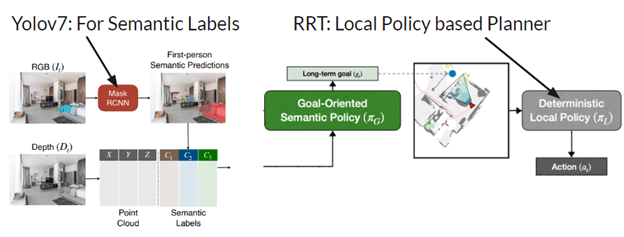
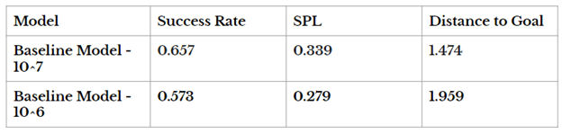

### Enhancement on Meta's Research Work

Enhanced Meta's object goal navigation using Goal-Oriented Semantic Exploration, integrating Yolov7 and RRT. Implemented semantic mapping, goal-oriented policy, and deterministic local policy, outperforming baselines in exploration and planning. Achievements include improved success rates, SPL efficiency, and adaptability for real-world applications, contributing to the field of autonomous navigation. Technologies: Yolov7, RRT, semantic segmentation, Fast Marching Method, Python.

**Proposed Changes**

##### **Results**
**Results: Baseline of the Paper**

**Enhancements on Computer Vision**

**Note**: Baseline paper trains for 10M timesteps, our work runs for 1M due to time constraints

 

    <i>Wanna know more about this project? Blogged <a href="/blog/metaresearch">here</a></i>

 