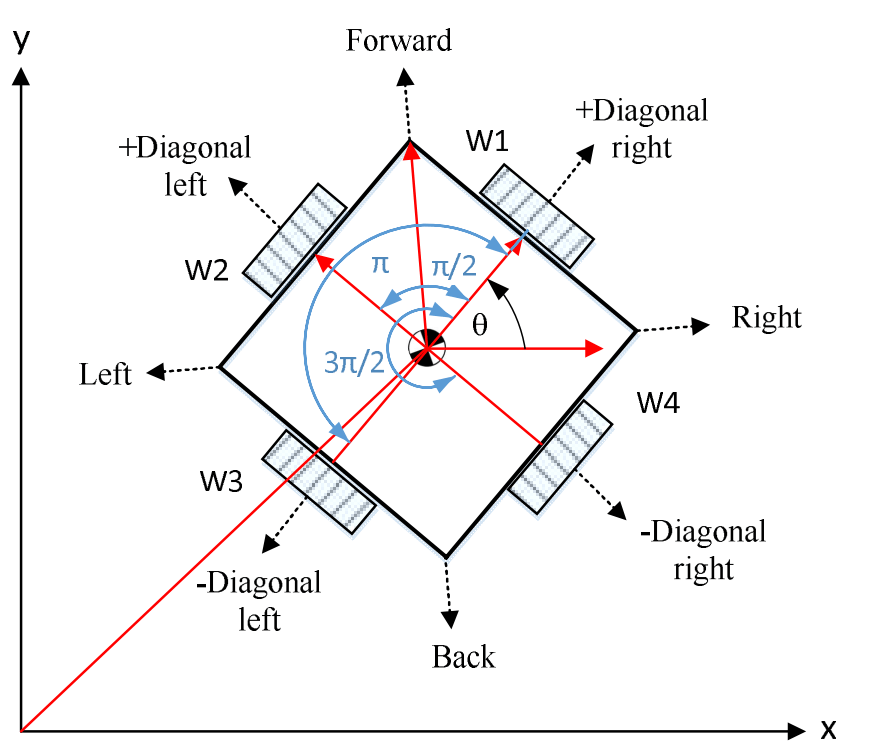
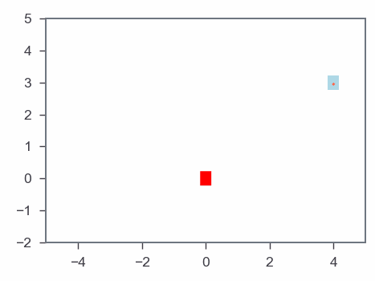

## Navigation of 4-Omini Wheeled using Gradient-based Algorithms and Model Predictive Control
 

#### **Problem Statement**
<html>
<head>  
<meta charset="UTF-8">
<meta name="viewport" content="width=device-width, initial-scale=1.0">

</head>
<body>

Consider a simple formulation of rocket landing where the rocket state \(\textbf{x}(t)\) is represented by velocity of the robot \(\dot{x}(t)\), \(\dot{y}(t)\), and angular velocity \(\dot{\theta}(t)\) followed by robot's coordinates \(x(t)\) and \(y(t)\), and orientation \(\theta(t)\), i.e., \(\textbf{x}(t) = [\dot{x}(t), \dot{y}(t), \dot{\theta}(t), x(t), y(t), \theta(t)]^T\), where \(t\) specifies time. The control input \(\textbf{u}(t)\) of the rocket includes angular velocity of each wheel of the robot \(\omega_{1}(t)\), \(\omega_{2}(t)\), \(\omega_{3}(t)\), and \(\omega_{4}(t)\).

</body>
</html>

#### **Gradient Based algorithm & Optmization**

<html>
<head>  
 
</head>
<body>

<b>Problem Statement: </b>
The optimization problem is now formulated as

\[
\begin{aligned}
\min_{w} \quad & \quad ||x(T)||^2 \\
\quad & \quad \dot{x}(t) = \frac{\text{rwheel}}{2}\left(-\sin(\theta+\pi/4)\omega_{1}(t)-\sin(\theta+3\pi/4)\omega_{2}(t)-\sin(\theta+5\pi/4)\omega_{3}(t)-\sin(\theta+7\pi/4)\omega_{4}(t)\right) \\
\quad & \quad \dot{y}(t) = \frac{\text{rwheel}}{2}\left(\cos(\theta+\pi/4)\omega_{1}(t)+\cos(\theta+3\pi/4)\omega_{2}(t)+\cos(\theta+5\pi/4)\omega_{3}(t)+\cos(\theta+7\pi/4)\omega_{4}(t)\right) \\
\quad & \quad \dot{\theta}(t) =  \frac{\text{rwheel}}{2}\left( \frac{1}{2\text{rRobot}}\omega_{1}(t)+\frac{1}{2\text{rRobot}}\omega_{2}(t)+\frac{1}{2\text{rRobot}}\omega_{3}(t)+\frac{1}{2\text{rRobot}}\omega_{4}(t)\right), \\
\quad & \quad x(t+1) = x(t) + \dot{x}(t) \Delta t, \\
\quad & \quad y(t+1) = y(t) + \dot{y}(t) \Delta t, \\
\quad & \quad \theta(t+1) = \theta(t) + \dot{\theta}(t) \Delta t \\
\quad & \quad \text{u}(t) = \pi_{w}(\textbf{x}(t)), ~\forall t=1,...,T-1
\end{aligned}
\]

While this problem is constrained, it is easy to see that the objective function can be expressed as a function of \(\textbf{x}(T-1)\) and \(\textbf{u}(T-1)\), where \(\textbf{x}(T-1)\) as a function of \(\textbf{x}(T-2)\) and \(\textbf{u}(T-2)\), and so on. Thus it is essentially an unconstrained problem with respect to \(w\).

</body>
</html>
This will be the navigation of the Omini Wheel Controller optimized using Gradient Based Algorithm using Neural Network.

###### Results: Gradient-based algorithm

  

#### **MPC & Optmization**
<html>
<head>  
 
</head>
<body>

<b>Problem Statement: </b>
Using taylor's series, linearized dynamics is passed into MPC algorithm of the dynamics \(f(\textbf{x},u(t))\) at the current state \(\textbf{x}_0\) and zero control input.

\[ A = \nabla_x f = \left[\begin{array}{llll}
        1 & 0 & 0 & 0 & 0 & 0\\
        0 & 1 & 0 & 0 & 0 & 0\\
        0 & 0 & 1 & 0 & 0 & 0\\
        \Delta t & 0 & 0 & 1 & 0 & 0\\
        0 & \Delta t & 0 & 0 & 1 & 0\\
        0 & 0 & \Delta t & 0 & 0 & 1\\ 
        \end{array}\right] \]

and

\[ B = \nabla_u f = \left[\begin{array}{llll}
-\sin(\theta+\pi/4) & -\sin(\theta+3\pi/4) & -\sin(\theta+5\pi/4) & -\sin(\theta+7\pi/4) \\
\cos(\theta+\pi/4) & \cos(\theta+3\pi/4) & \cos(\theta+5\pi/4) & \cos(\theta+7\pi/4) \\
\frac{1}{2*rRobot} & \frac{1}{2*rRobot} & \frac{1}{2*rRobot} & \frac{1}{2*rRobot} \\
0 & 0 & 0 & 0  \\
0 & 0 & 0 & 0 \\
0 & 0 & 0 & 0 
\end{array}\right] \]

Then we have

\[ f(\textbf{x},u) \approx f(\textbf{x}_0,0) + A(\textbf{x}-\textbf{x}_0) + Bu \]

\[ f(\textbf{x},u) \approx A\textbf{x} + Bu \]

</body>
</html>
This will be the navigation of the Omini Wheel Controller optimized using MPC.

###### Results: MPC Optimization algorithm

  

#### **Repositories of Each Project**

- Gradient Based algorithm using Neural Network - Blogged [here](https://github.com/naren200/DesignOptimization/blob/master/Project%201/Project%201%20Updated%20Gradient.ipynb)
- MPC based controller - Blogged [here](https://github.com/naren200/DesignOptimization/blob/master/Project%202/Project%202%20MPC%20.ipynb)
