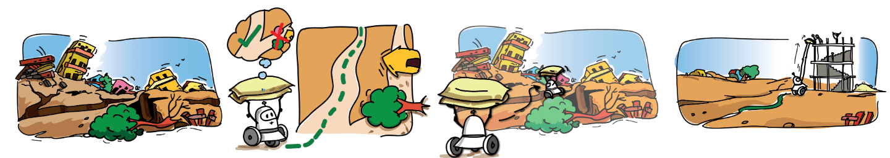

<!-- ###### Table of Content
- [**International eYantra Robotics Competition**](#objective)
- [**Critical Features of the Project**](#critical-features-of-the-project) 
- [**Achievements**](#achievements) :point_left:
- [**Miscellaneous**](#Miscellaneous) -->

## Motivation

Natural disasters like earthquakes, and landslides cause immense human and economic losses globally. In 2018 alone, 315 such disasters, affecting over 68 million people and causing $131.7 billion in damages. Post-disaster, reconstruction efforts are essential, but they are capital and labor-intensive, especially in challenging terrains. The e-Yantra Robotics Competition (eYRC 2019-20) addresses this by introducing the theme "Construct-o-Bot" to aid disaster-stricken areas.

##### Theme - Construct-O-Bot 
The "Construct-o-Bot" theme simulates a disaster site, where robots retrieve construction materials and navigate complex paths to deliver them for reconstruction. Using intelligent line-following and path-planning algorithms, these robots aim to reach their destination swiftly and safely, choosing the shortest routes. Success requires efficient delivery to multiple sites, including diverse terrains. <u>The winning team completes the task swiftly with minimal penalties</u>.

## Objective
Design and implement a robotic system capable of efficiently and safely assisting in disaster site reconstruction, addressing challenges such as material handling, navigation, and sensor calibration.

<!-- My team consisted of <a href="https://www.linkedin.com/in/neeraj-kumar-gond-543092170/">Neeraj Gond</a>, <a href="https://www.linkedin.com/in/nikhil-anand-3164b818b/">Nikhil Anand</a>, <a href="https://www.linkedin.com/in/narendhiran2000/">Narendhiran Saravanane</a>, and <a href="https://www.linkedin.com/in/neeraj-goyal-85067014b/">Neeraj Goyal</a>. Led by Narendhiran, our team won the competition completeling the track in minimum time with no penalities! -->

----

# Stage 1: Virtual Simulations
### Code Testing - Vrep Robotic Simulator
In our project, we harnessed the power of **V-rep**, a versatile robotic simulator, to rigorously test our autonomous system. Leveraging **embedded C**, we expertly coded our robot, equipping it with **proximity** and **white line sensors** for robust perception. Implementing the renowned **A* algorithm**, our robot exhibited intelligent navigation in complex terrains. Our system excelled in **precise object manipulation**, emphasizing our dedication to automation and robotics in the industry.

    <iframe width="560" height="315" src="https://www.youtube.com/embed/UqZlvbHdpMs?si=1xlNS-8Qw6fTCUFS" title="YouTube video player" frameborder="0" allow="accelerometer;  autoplay=0;  clipboard-write;encrypted-media; gyroscope; picture-in-picture; web-share" allowfullscreen></iframe>

# Stage 2: Real Life Deployments

### Task 2
**Solidworks Design and CNC Machining**: In our project, **SolidWorks** was instrumental in designing precise 3D models. These designs were brought to life through a **CNC machine**, which meticulously carved **acrylic sheets** with precision. This synergy between design software and CNC technology ensured high-quality results in the **engineering industry**.

 | 

----

##### Critical Features of the Project

**Electronics**

| **Category**        | **Components**                            |
|---------------------|------------------------------------------|
| **Sensors**         | Proximity Sensor/Sharp Sensor, White Line Sensor |
| **Actuators**       | Geared DC Motor with Encoder, Servo Motors |
| **Micro-Controllers**| Atmega 2560 Development board              |
| **Miscellaneous**   | LCD, L298N Motor Driver, Buzzers, Potentiometers |

**Actuations categorized based on sensors**

| **Sensors**        | **Actions**                                                                                |
|---------------------|-------------------------------------------------------------------------------------------|
**White Line Sensor** | Line Following, Node Detection, Black-White-Black Line Following & Zig Zag Line Following (Time Consuming & Not Effective)
**Proximity Sensor** | Wall Following & House/Block Detection
**Servo Motor** | Pick Blocks, Place Blocks at Different Heights (Low Rise & High Rise), 2 Servo Arm Design (Effective & Used) & 1 Servo Arm Design

### Task 3 
Transformed the 3D twin with Embedded C architecture and performed locomotion.

**Hardware**
- **Sensors**
    - Proximity Sensor/Sharp Sensor
    - White Line Sensor
- **Actuators**
    - Geared DC Motor with Encoder
    - Servo Motors
- **Micro-Controllers**
    - Atmega 2560 Development board

- **Miscellaneous**
    - LCD
    - L298N Motor Driver
    - Buzzers
    - Potentiometers

**Hardware Testing After Assembly**

    <iframe width="560" height="315" src="https://www.youtube.com/embed/RYoa6PcAsZs?si=F6VTSUC6STHSGCrw" title="YouTube video player" frameborder="0" allow="accelerometer;    autoplay=0;  clipboard-write; encrypted-media; gyroscope; picture-in-picture; web-share" allowfullscreen></iframe>

# Task 4
Performed line and wall following locomotion and Executed 4 pick and place actions.

<iframe width="560" height="315" src="https://www.youtube.com/embed/iJuiQmlL3tY?si=Y081eUNFsAsPyn-N" title="YouTube video player" frameborder="0" allow="accelerometer; autoplay=0; clipboard-write; encrypted-media; gyroscope; picture-in-picture; web-share" allowfullscreen></iframe>

# Task 5
Orchestrated 20 uninterrupted pick and place fully autonomous operations under 4 mins. 

<iframe width="860" height="515" src="https://www.youtube.com/embed/V-e3XbXu6AY?si=2X5BBffCpzHD_z1v" title="YouTube video player" frameborder="0" allow="accelerometer;    autoplay=0;  clipboard-write;encrypted-media; gyroscope; picture-in-picture; web-share" allowfullscreen></iframe>

----

## Algorthim Architecture
### Wall Following Algorithm

##### Zig Zag Following Algorithm

##### Full Competition Algorithm 

  

----
 
## Miscellaneous

## Outcomes
1) **National Finalists - IIT Bombay based Competition**: My team consisted of <a href="https://www.linkedin.com/in/neeraj-kumar-gond-543092170/">Neeraj Gond</a>, <a href="https://www.linkedin.com/in/nikhil-anand-3164b818b/">Nikhil Anand</a>, <a href="https://naren200.github.io/">Narendhiran Saravanane</a>, and <a href="https://www.linkedin.com/in/neeraj-goyal-85067014b/">Neeraj Goyal</a>. Led by Narendhiran, our team won the competition completeling the track in minimum time with no penalities! [Click here to explore further](../pdfs/eyrc_certificate.pdf) & View my presentation to the Panel Members, Academic Experts, and Industry Leads [here](https://www.youtube.com/live/NCbEUZE8Mh8?si=cSnDjut960LlgZRw&t=5812)

2) **Industry 4.0 I-4AM Conference - Indian Institute of Science, Banglore**: Simulated Operations of the robot under medical environments and and presented an implemented case study for swift transporation and sanitation management. View my Presenter Certificate [here](../pdfs/i4amcertificate.jpg) & View my Conference Publication [here](../pdfs/ID50_Full_Paper.pdf).

----

### Retrofitting challenges & Learnings:

1. **Gripper Misorientation:** Fast robot movements caused gripper misorientation during material pickup, hindering simulation accuracy. The solution involved increasing gripper contact surface (Fig. 4 & 6).

2. **Height Discrepancy:** The robot's 15cm height had to pick up material from a 3cm elevation. An L-shaped arm with servos for arm and gripper was implemented for cost-effectiveness (Fig. 5).

3. **Sensor Data Optimization:** LCD displays introduced lag during sensor calibration. Eliminating the LCD and using Tera-Term for serial communication resolved this issue.

