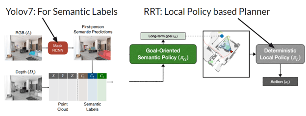
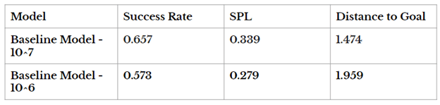
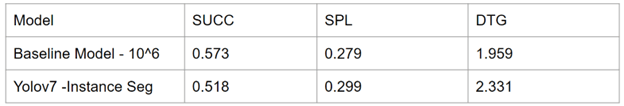

### Perception-Swapped Object-Goal Navigation (YOLOv7 + RRT on SemExp)

Rebuilt the **SemExp** modular object-goal-navigation stack — the Goal-Oriented Semantic Exploration model from Chaplot et al. (NeurIPS 2020, winner of the CVPR-2020 Habitat ObjectNav Challenge) — and swapped in **YOLOv7** for detection and **RRT** for the local planner to study how perception quality propagates through a perception → semantic-map → policy pipeline.

The system keeps the three-module structure: a **semantic mapping module** that builds an episodic top-down semantic map, a **goal-oriented semantic policy** that picks long-term goals, and a **deterministic local policy** for point-to-point navigation. My work isolates the perception/planning layer to measure its effect on exploration efficiency and SPL.

**Honest scope:** this is a study and partial reproduction, not a new SOTA — the original trains for 10M timesteps; compute limits capped my runs at 1M, so the numbers below characterize the perception swap rather than claim a win over the baseline. Technologies: YOLOv7, RRT, semantic segmentation, Fast Marching Method, Python.

**Proposed Changes**

##### **Results**
**Results: Baseline of the Paper**

**Enhancements on Computer Vision**

**Note**: Baseline paper trains for 10M timesteps, our work runs for 1M due to time constraints

 

    <i>Wanna know more about this project? Blogged <a href="/blog/metaresearch">here</a></i>

 