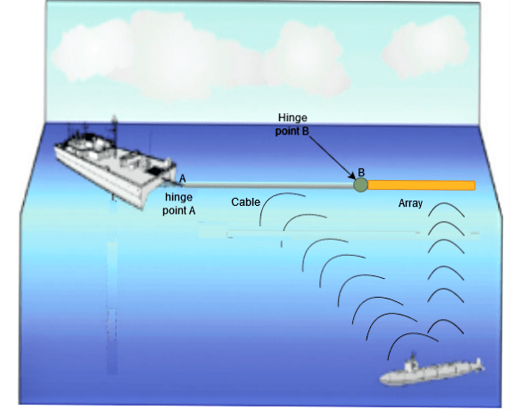
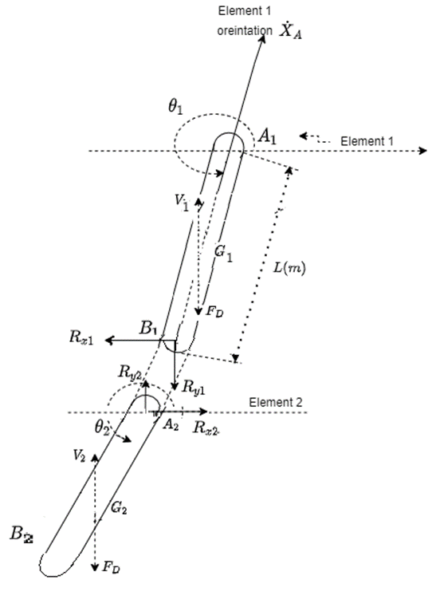
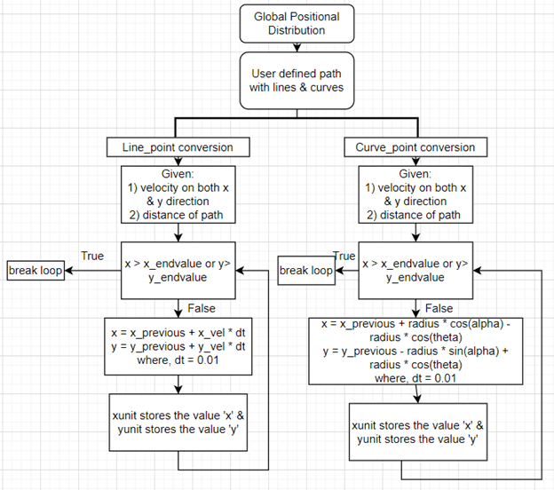
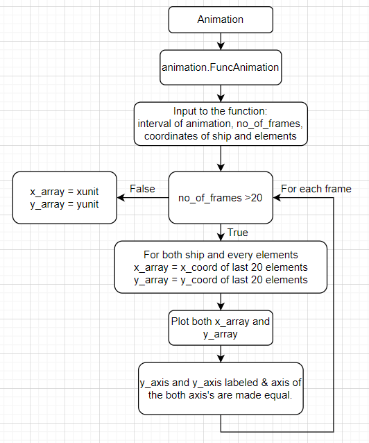
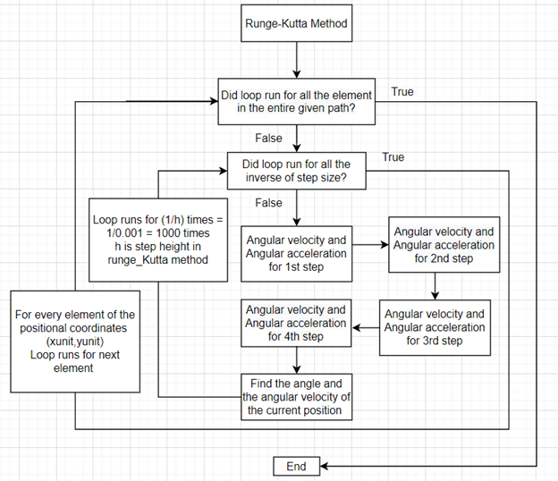
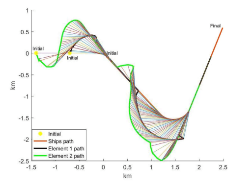
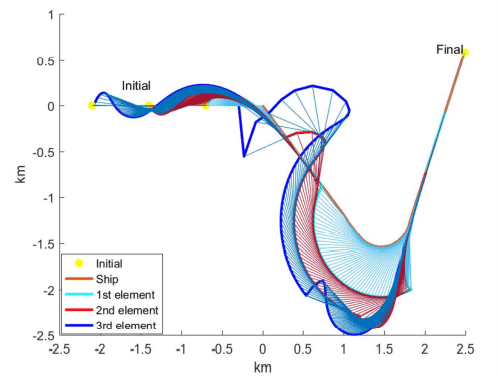
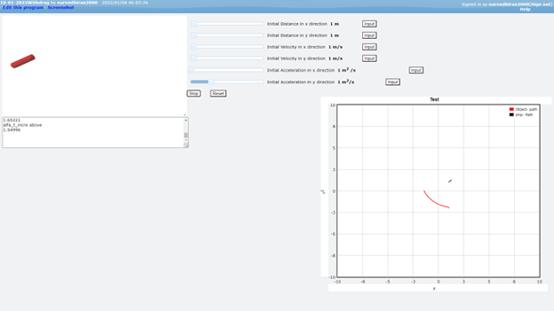

# Visualization and Prediction of Two-Dimensional Motion of Towed Objects in Ship Operations

### Introduction

This project aims to develop a visualizable prediction model for the **two-dimensional motion** of towed objects in ship operations, with a specific focus on situations involving **maneuvering or changing course**. The towed objects in question are hydrophone systems towed by military vessels, which are crucial for signal reception and tracking in both commercial and military applications.

### Objectives

The primary objectives of this project are as follows:

1. **Visualizable Model:** Develop a visualizable model for accurately predicting the position and orientation of a towed object attached to a ship or submarine underwater.

2. **Geo-Positioning:** Determine the geo-position of the towed object even when the ship is maneuvering or changing course.

3. **Impact Analysis:** Investigate the impact of mass and drag coefficient variations on the trajectory of the towed object.

----

### Methodology

The project utilizes a comprehensive methodology to achieve its objectives, including the consideration of **drag forces** and various scenarios. The key components of the methodology include:

#### Free Body Diagram of the 2 Element Mechanism

1. **Drag Force Analysis:** The project considers drag forces acting on the towed object, taking into account both **form drag** and **skin friction drag**, and employs the **drag force coefficient** formula.
2. **Assumptions:** Several assumptions are made to simplify the problem, such as assuming 2D dynamics, a still water surface, and the ability of the towed array system to overcome disturbances caused by waves.

3. **Global Position Distribution:** A flow chart is presented to illustrate the process of determining the coordinates of the ship's position and each element's position along the trajectory.

4. **Runge-Kutta Method:** The project employs the **Runge-Kutta method** to compute the angular position and angular velocity of each element at various time steps.

5. **Animation:** The **Matplotlib library** in Python is used to create animations that visualize the motion of the towed object and the ship.

6. **Impact Analysis:** The project assesses the impact of forces such as **reaction force** and **drag coefficient variations** on the towed object's path.

----

## Algorithms and Working Mechanism
### Flow chart of Global Positional distribution

### Flow chart of Animation

### Flow chart of Global Positional distribution

----

### Results and Discussion

The results and discussions chapter presents the outcomes of the project's methodology. It provides insights into different models, including one-element and two-element systems with varying drag force models. The results highlight the influence of parameters such as mass, drag coefficient, and reaction force on the path of the towed object.

#### 2 element Pulled by a ship floating over water exempting reaction force

<iframe width="860" height="515" src="https://www.youtube.com/embed/YFoKVlstZ_M?si=KGWpGarvp4oo-uqT" title="YouTube video player" frameborder="0" allow="accelerometer; autoplay; clipboard-write; encrypted-media; gyroscope; picture-in-picture; web-share" allowfullscreen></iframe>

#### 2 element Pulled by a ship floating over water

<iframe width="860" height="515" src="https://www.youtube.com/embed/vceQAGDQ87Y?si=YR_2BpI2SnBR0yrh&amp;start=4" title="YouTube video player" frameborder="0" allow="accelerometer; autoplay; clipboard-write; encrypted-media; gyroscope; picture-in-picture; web-share" allowfullscreen></iframe>

#### 3 element Pulled by a ship floating over water

<iframe width="860" height="515" src="https://www.youtube.com/embed/a6lihBmAW-k?si=WKNcNfPCVYQ2RxZo" title="YouTube video player" frameborder="0" allow="accelerometer; autoplay; clipboard-write; encrypted-media; gyroscope; picture-in-picture; web-share" allowfullscreen></iframe>

#### Desgined a GUI for visualization

<iframe width="860" height="515" src="https://www.youtube.com/embed/YjliApwyPz8?si=iNXiWvH-jmig4GaZ" title="YouTube video player" frameborder="0" allow="accelerometer; autoplay; clipboard-write; encrypted-media; gyroscope; picture-in-picture; web-share" allowfullscreen></iframe>

----

### Conclusion

In conclusion, this project addresses the critical need to predict and visualize the motion of towed objects in ship operations, especially in scenarios involving maneuvering. The developed visualizable model can assist military operations and enhance the effectiveness of towed array systems. Additionally, the project contributes to understanding the impact of drag forces and other parameters on the motion of towed objects.

By achieving its objectives and presenting valuable results, this project contributes to the field of marine technology and hydrodynamics, benefiting both military and commercial applications.

----

### Achievements
##### Selected as one of the **Top Projects** in the **Mechanical Engineering Department**, Indian Institute of Technology Patna, India.

### References
#### Presentation

<iframe src="https://docs.google.com/presentation/d/e/2PACX-1vS0RJFhrUeS5FA8i7XEwbZWVfNGFlW-1MuFLEV1Dqgy9I45SkpC43ROtj1-sLThOsvnsjhbm1e7GL8B/embed?start=true&loop=true&delayms=3000" frameborder="0" width="960" height="569" allowfullscreen="true" mozallowfullscreen="true" webkitallowfullscreen="true"></iframe>

#### Capstone Published Report FYI - Takes time to load :) 
<iframe width="860" height="815" src="https://docs.google.com/document/d/e/2PACX-1vQEjvZ7WFPeaCaECitunE8KDouWRWg3FyvxoIi6ortcic_arMBw8hQPu8k_WMAXVg/pub?embedded=true"></iframe>

