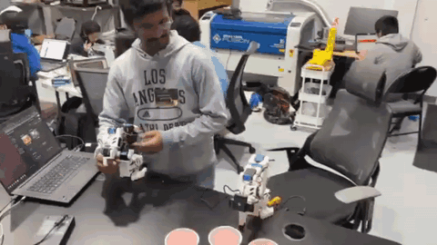

# Cup Stacking Robot - Embodied AI Hackathon

## Overview
Everyone is racing to give robots a better *mind*. The harder, less crowded half is the *body* — getting a policy to actually move a real arm and place a real object where it's supposed to go. This is a small, honest look at that problem: over a weekend at the Embodied AI Hackathon (Seeed Studio & NVIDIA, October 2025), a team of four took a public foundation model all the way to a real arm doing a real manipulation task on edge hardware.

Concretely: we fine-tuned NVIDIA's GR00T 1.5 foundation model and an Action Chunking Transformer (ACT) for vision-based cup stacking on the SO-101 arm, and deployed it on a Jetson Thor. It stacked. Sometimes it threw. That gap — between a model that works in a notebook and one that holds up on real hardware in the physical world — is exactly the part of physical AI I care about.

<i>Autonomous Cup Stacking in Action</i>

## Project Highlights

### Fine-Tuned Foundational Models
- **NVIDIA GR00T 1.5**: Leveraged NVIDIA's cutting-edge foundational model for robotic manipulation
- **ACT (Action Chunking Transformer)**: Implemented imitation learning policy for precise grasp-transfer-stack sequences
- **Model Deployment**: Optimized for real-time inference on NVIDIA Jetson Thor edge AI platform

### Data Collection & Training
- **Teleoperation Demonstrations**: Collected 80+ high-quality demonstrations of cup stacking sequences
- **Imitation Learning**: Trained policy to replicate human demonstrations with robust generalization
- **Sequence Learning**: Mastered multi-step manipulation: detect → grasp → transfer → stack

### Edge AI Deployment
- **Platform**: NVIDIA Jetson Thor for on-device inference
- **Performance**: Achieved robust real-time control with minimal latency
- **Integration**: Seamless deployment from training to production on edge hardware

## Technical Implementation

The system architecture combines:
- **Robot Platform**: SO-101 robotic arm with 6-DOF manipulation
- **Vision System**: Orbbec camera for object detection and pose estimation
- **Control Framework**: ROS2-based control with micro-ROS integration
- **Motor Control**: Feetech servos with precise position control

## Results

Successfully demonstrated autonomous cup stacking with:
- Consistent grasp detection and execution
- Smooth transfer motions minimizing cup disturbance
- Reliable stacking with proper alignment
- Real-time performance on edge hardware

## Challenges & Learnings

- **Data Quality**: Importance of diverse demonstrations for robust policy learning
- **Edge Optimization**: Balancing model complexity with inference speed on Jetson Thor
- **Hardware Integration**: Coordinating vision, control, and manipulation in real-time

## Team & Acknowledgments

**Team Members**: Narendhiran Saravanane, Anirudh Manjesh, Ayan Syed, Josue Tristan

**Hackathon**: Embodied AI Hackathon
**Organizers**: Seeed Studio & NVIDIA
**Date**: October 2025

## Links & Resources

- [Full Project Write-up on Hackster.io](https://www.hackster.io/josue-tristan/robot-cup-stacker-sometimes-thrower-36bd91)
- [GitHub Repository](https://github.com/naren200/mojo)

<iframe src="https://www.linkedin.com/embed/feed/update/urn:li:ugcPost:7388394434641571841?collapsed=1" height="542" width="504" frameborder="0" allowfullscreen="" title="Embedded post"></iframe>

---

*This project demonstrates the power of combining foundational models with imitation learning for robotic manipulation tasks, deployed on edge AI hardware for real-world applications.*
