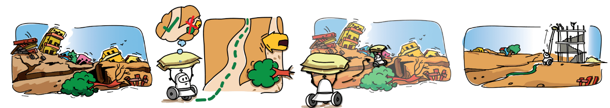
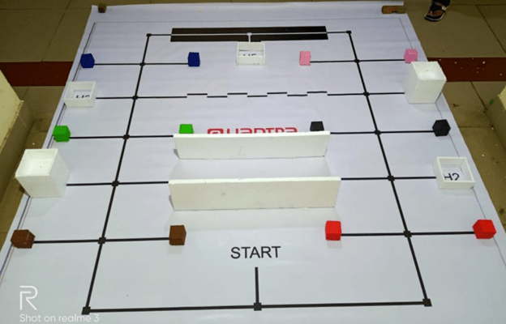
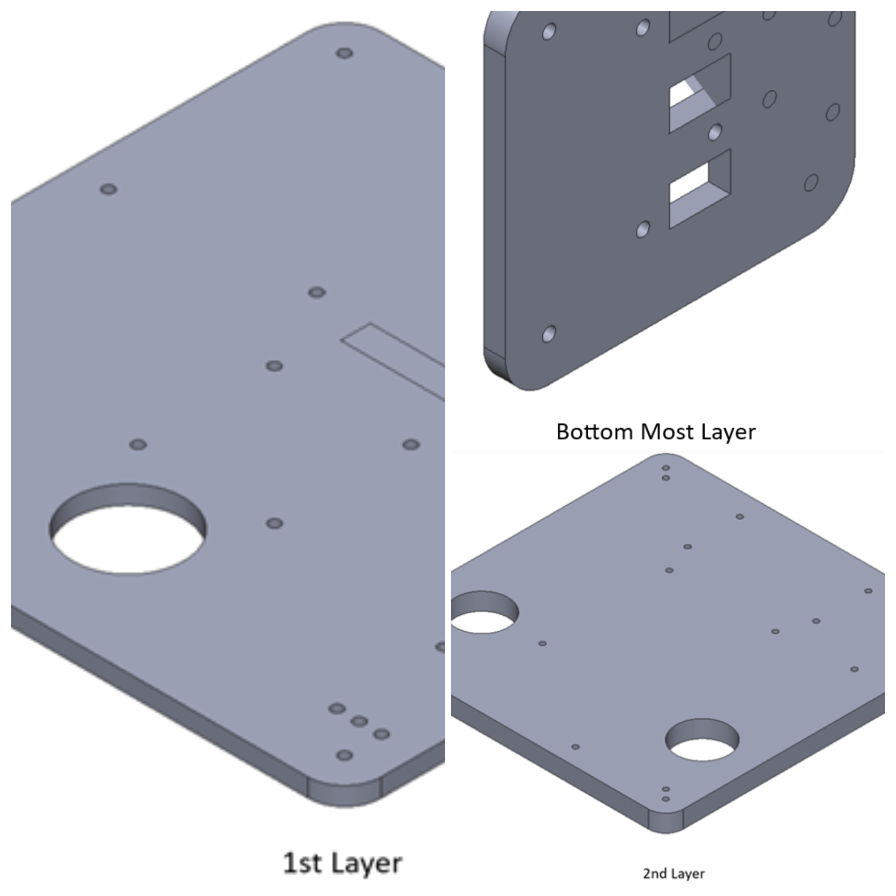
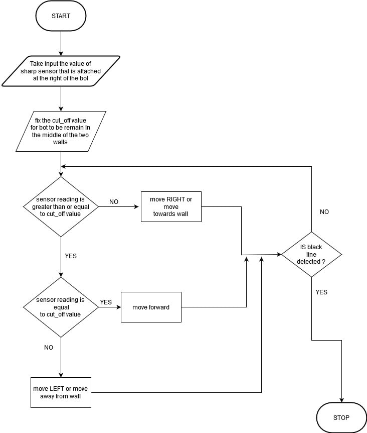
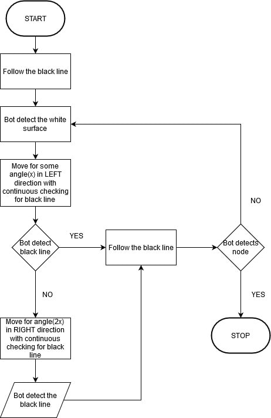
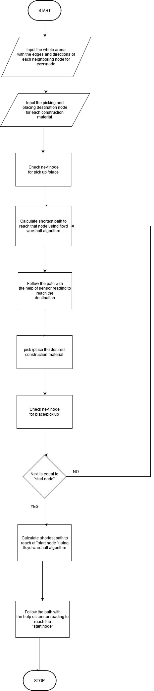
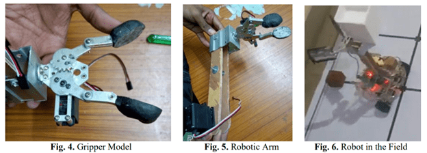

# International eYantra Robotics Competition

## Table of Content
1. [**International eYantra Robotics Competition**](#international-eyantra-robotics-competition) | [Motivation](#motivation) | [Theme - Construct-O-Bot](#theme---construct-o-bot) |  [Project Objective](#objective)
2. [**Hardware**](#hardware) | [Hardware Testing Before Assembly](#hardware-testing-before-assembly) | [Hardware Testing After Assembly](#hardware-testing-after-assembly)
3. [**Virtual Simulation**](#virtual-simulation) | [Code Testing - Vrep Robotic Simulator](#code-testing---vrep-robotic-simulator) | [Solidworks Design and CNC Machining](#solidworks-design-and-cnc-machining)
4. [**Critical Features of the Project**](#critical-features-of-the-project)
5. [**Flow Charts**](#flow-charts) -> [Wall Following Algorithm](#wall-following-algorithm) | [Zig Zag Following Algorithm](#zig-zag-following-algorithm) | [Full Competition Algorithm](#full-competition-algorithm)
6. [**Retrofitting challenges**](#retrofitting-challenges)
7. [**Achievements**](#achievements)
8. [**Paper Published on this working model - Indian Institute of Technology Science, Bangalore**](#paper-published---indian-institute-of-technology-science-bangalore)
9. [**References**](#references)

## Motivation

Natural disasters like extreme rainfall, earthquakes, landslides, and floods cause immense human and economic losses globally. In 2018 alone, 315 such disasters resulted in 11,804 fatalities, affecting over 68 million people and causing $131.7 billion in damages. Post-disaster, reconstruction efforts are essential, but they are capital and labor-intensive, especially in challenging terrains. The e-Yantra Robotics Competition (eYRC 2019-20) addresses this by introducing the theme "Construct-o-Bot" to aid disaster-stricken areas.

## Theme - Construct-O-Bot 
The "Construct-o-Bot" theme simulates a disaster site, where robots retrieve construction materials and navigate complex paths to deliver them for reconstruction. Using intelligent line-following and path-planning algorithms, these robots aim to reach their destination swiftly and safely, choosing the shortest routes. At the site, they must precisely position materials at varying heights. Success requires efficient delivery to multiple sites, including diverse terrains. The winning team completes the task swiftly with minimal penalties.

## Objective
Design and implement a robotic system capable of efficiently and safely assisting in disaster site reconstruction, addressing challenges such as material handling, navigation, and sensor calibration.

My team consisted of <a href="https://www.linkedin.com/in/neeraj-kumar-gond-543092170/">Neeraj Gond</a>, <a href="https://www.linkedin.com/in/nikhil-anand-3164b818b/">Nikhil Anand</a>, <a href="https://naren200.github.io/">Narendhiran Saravanane</a>, and <a href="https://www.linkedin.com/in/neeraj-goyal-85067014b/">Neeraj Goyal</a>. Led by Narendhiran, our team won the competition completeling the track in minimum time with no penalities!

## Hardware
**Sensors**
1. Proximity Sensor/Sharp Sensor
2. White Line Sensor

**Actuators**
1. Geared DC Motor with Encoder
2. Servo Motors

**Micro-Controllers**
1. Atmega 2560 Development board

**Miscellaneous**
1. LCD
2. L298N Motor Driver
3. Buzzers
4. Potentiometers

**Hardware Testing Before Assembly**

    <iframe width="560" height="315" src="https://www.youtube.com/embed/AbuGMjoGe7Q?si=x4FHMmbtjjgI6C3F" title="YouTube video player" frameborder="0" allow="accelerometer; autoplay; clipboard-write; encrypted-media; gyroscope; picture-in-picture; web-share" allowfullscreen></iframe>

**Hardware Testing After Assembly**

    <iframe width="560" height="315" src="https://www.youtube.com/embed/RYoa6PcAsZs?si=F6VTSUC6STHSGCrw" title="YouTube video player" frameborder="0" allow="accelerometer; autoplay; clipboard-write; encrypted-media; gyroscope; picture-in-picture; web-share" allowfullscreen></iframe>

----

## <u>Virtual Simulation</u>
### Code Testing - Vrep Robotic Simulator
In our project, we harnessed the power of **V-rep**, a versatile robotic simulator, to rigorously test our autonomous system. Leveraging **embedded C**, we expertly coded our robot, equipping it with **proximity** and **white line sensors** for robust perception. Implementing the renowned **A* algorithm**, our robot exhibited intelligent navigation in complex terrains. Our system excelled in **precise object manipulation**, emphasizing our dedication to automation and robotics in the industry.

    <iframe width="560" height="315" src="https://www.youtube.com/embed/UqZlvbHdpMs?si=1xlNS-8Qw6fTCUFS" title="YouTube video player" frameborder="0" allow="accelerometer; autoplay; clipboard-write; encrypted-media; gyroscope; picture-in-picture; web-share" allowfullscreen></iframe>

### Solidworks Design and CNC Machining
In our project, **SolidWorks** was instrumental in designing precise 3D models. These designs were brought to life through a **CNC machine**, which meticulously carved **acrylic sheets** with precision. This synergy between design software and CNC technology ensured high-quality results in the **engineering industry**.

----

## <u>Critical Features of the Project</u>

**White Line Sensor:**
1. Line Following
2. Node Detection
3. Black-White-Black Line Following
4. Zig Zag Line Following (Time Consuming & Not Effective)

**Proximity Sensor:**
1. Wall Following
2. House/Block Detection

**Servo Motor:**
1. Pick Blocks
2. Place Blocks at Different Heights (Low Rise & High Rise)
3. 2 Servo Arm Design (Effective & Used)
4. 1 Servo Arm Design

These features highlight the key functionalities and components of this project, showcasing the capabilities of this robot, including its ability to follow lines, detect nodes, navigate black-white-black patterns, handle proximity to walls, detect houses or blocks, and effectively manipulate blocks using servo arms at varying heights.

<u>Note: Quick Highlights - All Essential Strategies Showcased.</u>
<iframe width="860" height="515" src="https://www.youtube.com/embed/w3wBqJ6DisA?si=7jdh7NidJmqMFRql" title="YouTube video player" frameborder="0" allow="accelerometer; autoplay; clipboard-write; encrypted-media; gyroscope; picture-in-picture; web-share" allowfullscreen></iframe>

----

## Flow Charts
### Wall Following Algorithm

### Zig Zag Following Algorithm

### Full Competition Algorithm 

----

## Retrofitting challenges:

1. **Gripper Misorientation:** Fast robot movements caused gripper misorientation during material pickup, hindering simulation accuracy. The solution involved increasing gripper contact surface (Fig. 4 & 6).

2. **Height Discrepancy:** The robot's 15cm height had to pick up material from a 3cm elevation. An L-shaped arm with servos for arm and gripper was implemented for cost-effectiveness (Fig. 5).

3. **Sensor Data Optimization:** LCD displays introduced lag during sensor calibration. Eliminating the LCD and using Tera-Term for serial communication resolved this issue.

 

## Achievements 
##### This team has been selected as one of **National Finalists out of 1051 teams** in the **Construct-O-Bot theme**. 
<iframe src="../pdfs/eyrc_certificate.pdf" width="80%" height="800px" frameborder="0"></iframe>

## Paper Published - Indian Institute of Technology Science, Banglore
<iframe src="../pdfs/ID50_Full_Paper.pdf" width="80%" height="800px" frameborder="0"></iframe>

----

## References

### Project Submission Video

<iframe width="860" height="515" src="https://www.youtube.com/embed/V-e3XbXu6AY?si=2X5BBffCpzHD_z1v" title="YouTube video player" frameborder="0" allow="accelerometer; autoplay; clipboard-write; encrypted-media; gyroscope; picture-in-picture; web-share" allowfullscreen></iframe>

### Presentation before Panel Members, Academic Experts, and Industry Leads

    <iframe width="560" height="315" src="https://www.youtube.com/embed/NCbEUZE8Mh8?si=8ZX-ViTfTSaYfeRE&amp;start=5811" title="YouTube video player" frameborder="0" allow="accelerometer; autoplay; clipboard-write; encrypted-media; gyroscope; picture-in-picture; web-share" allowfullscreen></iframe>

