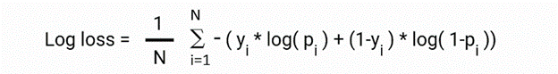

---
layout: project
title: "Deep Convolutional Generative Adversarial Networks (DCGAN)"
date: 2023-09-13
image: /assets/images/dcgan.jpg
---

# Deep Convolutional Generative Adversarial Networks (DCGAN)

DCGAN is a project that explores the world of Generative Adversarial Networks (GANs) to create realistic images. GANs consist of two networks, a Generator, and a Discriminator, that are trained together in a competitive setting. The Generator learns to create images that are similar to a given dataset, while the Discriminator learns to distinguish between real and generated images.

## Project Overview

The primary goal of this project was to implement a DCGAN architecture using Python and popular deep learning libraries like TensorFlow and Keras. This DCGAN was designed to generate images that resemble a dataset of fashion items. Here's a brief overview of the project:

### Key Components of DcGANs

- **Generator**: The Generator network takes random noise as input and generates images. It consists of multiple layers of transposed convolutional layers, batch normalization, and activation functions.

- **Discriminator**: The Discriminator network evaluates the authenticity of an image, determining whether it's real (from the dataset) or fake (generated by the Generator). It uses convolutional layers, LeakyReLU activation, and sigmoid activation for binary classification.

- **Training**: The DCGAN is trained in a two-step process. First, the Discriminator is trained to distinguish real from generated images. Then, the Generator is trained to produce images that can fool the Discriminator.

- **Data Preparation**: The project uses the Fashion MNIST dataset, which contains grayscale images of various fashion items. The dataset is preprocessed to scale pixel values to the range [-1, 1].

### Dataset

- **Fashion MNIST Dataset**:
  - Contains 70,000 grayscale images.
  - Split into 60,000 training and 10,000 testing images.
  - Images are 28 x 28 pixels in size.
  - Includes 10 fashion categories.
  - Licensed under the MIT License.
  - Available in Keras.

### Training Overview

The DCGAN is trained over several epochs, and the training process includes visualizing generated images and monitoring losses. The goal is to achieve a Generator that can produce fashion item images that are visually similar to the dataset.

### Training Details

- **Bird's Eye View**:
  - Trained for 50 epochs.
  - Batch size of 128.
  - Learning rate set to 2e-4.
  - Generator input: Random noise vectors of 100 numbers, sampled from a uniform distribution between -1 and 1.
  - Generator uses deconvolution layers for upsampling.

### Evaluation Metrics

- **Metric**: Accuracy.
- **Use**: Binary classification accuracy for generated images.
- **Note**: Both classes (real and generated) are equally important.

### Loss Function

- **Loss Function**: Binary Cross-Entropy (Log Loss).

- **Game of Minimax**: DCGAN involves two neural networks, the Generator and the Discriminator, in a minimax game.
  - Generator minimizes the loss function.
  - Discriminator maximizes the same loss function.
  - Loss function components:
    - D(x): Discriminator's estimate of the probability that real data is real.
    - Ez: Expected value over all random inputs to the generator.
    - G(z): Generator's output when given noise z.
    - D(G(z)): Discriminator's estimate of the probability that a fake instance is real.
    - Ex: Expected value over all real data instances.

### Visualizations

The project includes visualizations of generated images at different training stages to showcase the progress and capabilities of the DCGAN.

## Project Outcome

DCGAN is a powerful generative model that has applications in image generation, data augmentation, and more. This project demonstrates the implementation and training of a DCGAN architecture to generate fashion item images. It serves as a foundation for understanding GANs and their applications in the field of computer vision.

<iframe width="560" height="315" src="https://www.youtube.com/embed/cyXw7y1FSA0?si=uLTzm8v80Qx5R5La" title="YouTube video player" frameborder="0" allow="accelerometer; autoplay; clipboard-write; encrypted-media; gyroscope; picture-in-picture; web-share" allowfullscreen></iframe>

#### Graph of the DCGAN loss vs. epoch

## Conclusion

The DCGAN project provides insights into the world of generative modeling and its potential for creating realistic images. It's a stepping stone for further exploration of GANs and their applications in various domains, including art generation, image-to-image translation, and more.

If you have any questions or want to learn more about this project, feel free to [contact me](mailto:narendhiran2000@gmail.com). I'm excited to share my insights into DCGAN and its applications.

