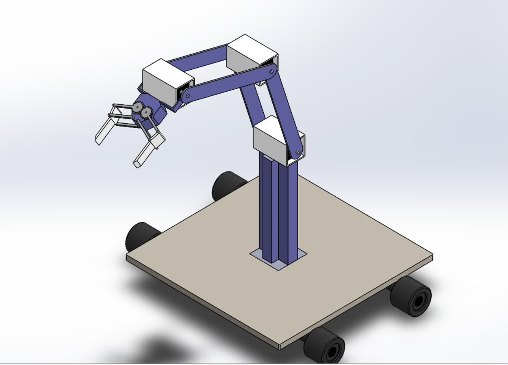

# Intelligent Picking Robot - Flipkart Grid 2.0

This <a href="https://drive.google.com/file/d/16Ery9lDJ0KdCSDfP-fYXSueXr-E2Snwk/view?usp=sharing">problem statement</a> tries to replicate the quintessential warehouse problem of picking in which the participants are supposed to build their own robot hardware and software (collectively, a “Robot”) that is capable of doing general tasks of picking items from a pick area and place them into a cell in th drop/stow area. There are few households objects at a height of 100cm from the ground on a table, which is termed as the pick up area. We have to design a mechanism which can pick up these objects and then put them in a stow area in a particular manner.

The competition consisted of 4 rounds. We qualified to reach Stage 3 and were among the top 121 teams out of 6000+ teams registered for the same.

The following <a href="https://drive.google.com/file/d/1YR9vIRvJ0FvX6L5vVUl5VIaM6T62OgSc/view?usp=sharing"> presentation</a> gives a glimpse into our solution.

