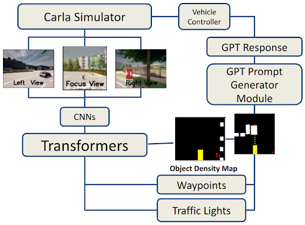
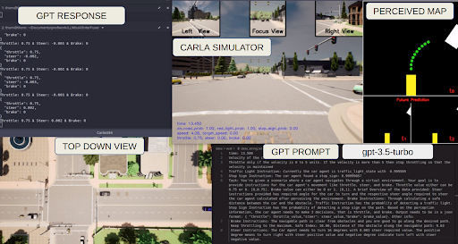

# Improved Safety Control for Autonomous Driving using GPT (LLMs) - Case Study

## Problem Statement
An  open-source  platform, Carla Simulator  that facilitates  tackling  the  complexities  of  autonomous driving by enhancing safety and scene perception. Autonomous  driving  safety  is hindered  by  unexpected  behaviors  in  dense  traffic. Enhanced Safety control using multi-domain skilled GPT to make decision for better decision making process.

<i>Designed LLM cum Autonomous Driving Pipeline</i>

<i>Simulator Representation</i>

## Results

<iframe width="560" height="315" src="https://www.youtube.com/embed/P9r-5-0wSMo?si=qK1tMFsRA5yURkH2" title="YouTube video player" frameborder="0" allow="accelerometer; autoplay; clipboard-write; encrypted-media; gyroscope; picture-in-picture; web-share" referrerpolicy="strict-origin-when-cross-origin" allowfullscreen></iframe>

<!--  -->

<i>Unexpected Overtaking - Rash Drivers</i>

---

<iframe width="560" height="315" src="https://www.youtube.com/embed/foH7Dd48Lwc?si=sox_IoDxvuE0EewD" title="YouTube video player" frameborder="0" allow="accelerometer; autoplay; clipboard-write; encrypted-media; gyroscope; picture-in-picture; web-share" referrerpolicy="strict-origin-when-cross-origin" allowfullscreen></iframe>

<!--  -->

<i>Smart Lane Change Actions for taking Free-Right</i>

---

<iframe width="560" height="315" src="https://www.youtube.com/embed/Mwf--qOuObY?si=r_ohwfmxfa7mI1g5" title="YouTube video player" frameborder="0" allow="accelerometer; autoplay; clipboard-write; encrypted-media; gyroscope; picture-in-picture; web-share" referrerpolicy="strict-origin-when-cross-origin" allowfullscreen></iframe>

<!--  -->

<i>Environment Aware Decision making for Collision Avoidance</i>

---

<iframe width="560" height="315" src="https://www.youtube.com/embed/0BENUpvEezE?si=cooI84Tg6Xb2SIfg" title="YouTube video player" frameborder="0" allow="accelerometer; autoplay; clipboard-write; encrypted-media; gyroscope; picture-in-picture; web-share" referrerpolicy="strict-origin-when-cross-origin" allowfullscreen></iframe>

<!--  -->

<i>Overtaking Obstacle</i>

---

<!-- 

<iframe width="560" height="315" src="https://www.youtube.com/embed/6bzMPuyov90?si=hNONuZh5rbvhqXwm" title="YouTube video player" frameborder="0" allow="accelerometer; autoplay; clipboard-write; encrypted-media; gyroscope; picture-in-picture; web-share" referrerpolicy="strict-origin-when-cross-origin" allowfullscreen></iframe>

<!--  

<i>Curved Lane Following</i>

---
-->

## Challenges & Future Research Work

<iframe width="560" height="315" src="https://www.youtube.com/embed/lJbwbrMoVrs?si=tTWL-2ifV2jMoEPm" title="YouTube video player" frameborder="0" allow="accelerometer; autoplay; clipboard-write; encrypted-media; gyroscope; picture-in-picture; web-share" referrerpolicy="strict-origin-when-cross-origin" allowfullscreen></iframe>

<!--  -->

<i>Uncertain Decision Making at Long Curved Track</i>

---

<iframe width="560" height="315" src="https://www.youtube.com/embed/9g3hN4gV6t4?si=kyWIhe3mkoIudrtZ" title="YouTube video player" frameborder="0" allow="accelerometer; autoplay; clipboard-write; encrypted-media; gyroscope; picture-in-picture; web-share" referrerpolicy="strict-origin-when-cross-origin" allowfullscreen></iframe>

<!--  -->

<i>Lacking Long Term Decision considering time taken to cross the intersection</i>

---

### Reference
- For Capstone project Poster, Click [here](../pdfs/masterPoster.pdf)
- Baseline project's repository, [Interfuser](https://github.com/opendilab/InterFuser/)
- For Linkedin Post, Click [here](https://www.linkedin.com/posts/narendhiran2000_symposium-autonomousdriving-carla-activity-7191559855181070336-TcLM?utm_source=share&utm_medium=member_desktop)