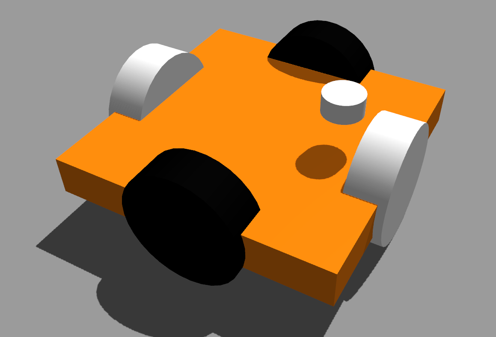

# International eYantra Robotics Competition

## Motivation

Environmental conditions such as extreme rainfall, earthquakes, landslides and floods often cause natural disasters which lead to tremendous loss of life and property, causing great disruption in people’s lives and the economy. In 2018, across the world there were 315 natural disaster events recorded with 11,804 deaths, over 68 millions of people were affected, and 131.7 billion dollars in economic losses.

After a disaster strikes, governments and private organizations engage in reconstruction efforts of infrastructure, such as roads, bridges, power and railway lines, houses etc. This is a very labor and capital-intensive task. Moreover, doing this at a disaster site, with its multiple associated risks and challenging terrain, poses an additional challenge. Motivated by this scenario, in order to help the needy victims in the affected areas, this edition of e-Yantra Robotics Competition (eYRC 2019-20) presents the theme Contruct-o-Bot.

## Theme - Construct-O-Bot 
In this theme, the arena is an abstraction of a disaster site where the robot picks the construction material and traverses paths in order to deposit it at the site to be reconstructed. In order to maneuver over these paths, the Construct-O-Bot has to use intelligent line-following and path-planning algorithms to reach safely and quickly using shortest paths. After reaching the site, the Construct-O-Bot carefully has to place the material at the required positions which may include placing the material at different heights from the ground. It has to deposit all required material at multiple construction sites, navigating through various terrains.

The team that finishes the given task in the least amount of time whilst incurring the least penalties will be declared the winner.

## Objective
The objective was to design an autonomous bot simulated using ROS and Gazebo to reach from the corner square to the center of an unknown maze in the shortest time.

My team consisted of <a href="https://trunc8.github.io/">Siddharth Saha</a> and Shubham Agrawal. Led by Siddharth, our team won the competition completeling the track in minimum time with no penalities!

Our implementation can be seen <a href="https://www.youtube.com/watch?v=PcbNQ-tVwQw">here</a> and the link the repository is <a href="https://github.com/trunc8/international-micromouse-techfest2020">here.</a>

### <u>Design</u>
We came up with omni-wheeled bot to reduce steering latency.

Types of successful activities/features performed:
 
1) white line sensor: 
                line following           
                node detection
                Black-White-Black following 
                zig zag line following   (time consuming & not effective)

2) proximity sensor:
                wall following 
                House/Block detection 
3) Servo motor:
                Pick blocks
                Place on different height (Low rise & High rise)
                2 Servo arm design (effective & used)
                1 servo arm design

## Hardware 
- Sensors
    - Proximity Sensor/ Sharp Sensor
    - White Line Sensor
- Actuators
    - Geared DC Motor with Encoder
    - Servo Motors
- Micro-Controllers
    - Atmega 2560 Development board
- Miscellaneous
    - LCD
    - L298N Motor Driver
    - Buzzers
    - Potentiometers

### Hardware Testing Before Assembly

<iframe width="560" height="315" src="https://www.youtube.com/embed/AbuGMjoGe7Q?si=x4FHMmbtjjgI6C3F" title="YouTube video player" frameborder="0" allow="accelerometer; autoplay; clipboard-write; encrypted-media; gyroscope; picture-in-picture; web-share" allowfullscreen></iframe>

### Hardware Testing After Assembly

<iframe width="560" height="315" src="https://www.youtube.com/embed/RYoa6PcAsZs?si=F6VTSUC6STHSGCrw" title="YouTube video player" frameborder="0" allow="accelerometer; autoplay; clipboard-write; encrypted-media; gyroscope; picture-in-picture; web-share" allowfullscreen></iframe>

## Virtual Simulation - V-Rep
<iframe width="560" height="315" src="https://www.youtube.com/embed/UqZlvbHdpMs?si=1xlNS-8Qw6fTCUFS" title="YouTube video player" frameborder="0" allow="accelerometer; autoplay; clipboard-write; encrypted-media; gyroscope; picture-in-picture; web-share" allowfullscreen></iframe>

## <u> Solidworks Design and CNC Machining</u>

## Final Task - Project Submission Video

<iframe width="560" height="315" src="https://www.youtube.com/embed/V-e3XbXu6AY?si=2X5BBffCpzHD_z1v" title="YouTube video player" frameborder="0" allow="accelerometer; autoplay; clipboard-write; encrypted-media; gyroscope; picture-in-picture; web-share" allowfullscreen></iframe>
