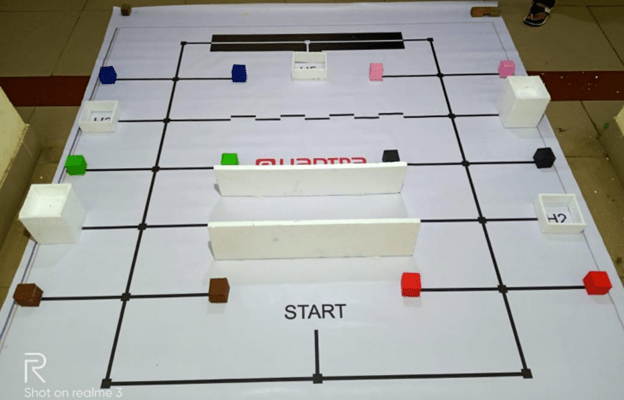
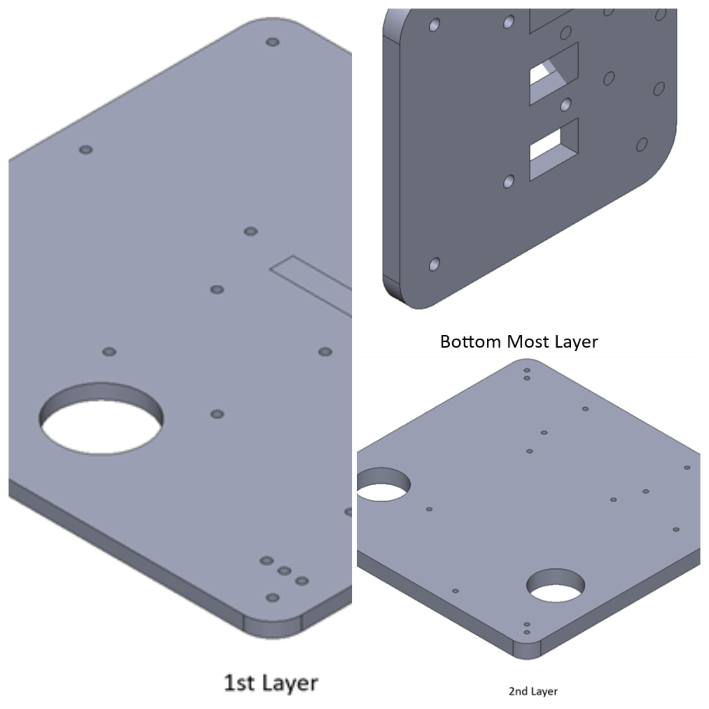
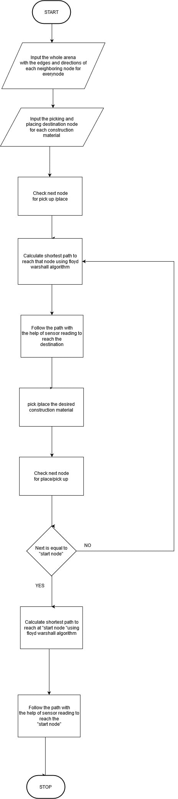
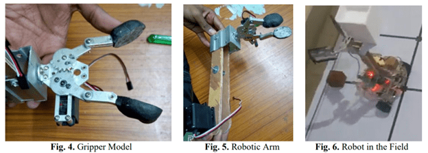

# International eYantra Robotics Competition

## Motivation

Environmental conditions such as extreme rainfall, earthquakes, landslides and floods often cause natural disasters which lead to tremendous loss of life and property, causing great disruption in people’s lives and the economy. In 2018, across the world there were 315 natural disaster events recorded with 11,804 deaths, over 68 millions of people were affected, and 131.7 billion dollars in economic losses.

After a disaster strikes, governments and private organizations engage in reconstruction efforts of infrastructure, such as roads, bridges, power and railway lines, houses etc. This is a very labor and capital-intensive task. Moreover, doing this at a disaster site, with its multiple associated risks and challenging terrain, poses an additional challenge. Motivated by this scenario, in order to help the needy victims in the affected areas, this edition of e-Yantra Robotics Competition (eYRC 2019-20) presents the theme Contruct-o-Bot.

## Theme - Construct-O-Bot 
In this theme, the arena is an abstraction of a disaster site where the robot picks the construction material and traverses paths in order to deposit it at the site to be reconstructed. In order to maneuver over these paths, the Construct-O-Bot has to use intelligent line-following and path-planning algorithms to reach safely and quickly using shortest paths. After reaching the site, the Construct-O-Bot carefully has to place the material at the required positions which may include placing the material at different heights from the ground. It has to deposit all required material at multiple construction sites, navigating through various terrains.

The team that finishes the given task in the least amount of time whilst incurring the least penalties will be declared the winner.

## Objective
Design and implement a robotic system capable of efficiently and safely assisting in disaster site reconstruction, addressing challenges such as material handling, navigation, and sensor calibration.

My team consisted of <a href="https://www.linkedin.com/in/neeraj-kumar-gond-543092170/">Neeraj Gond</a>, <a href="https://www.linkedin.com/in/nikhil-anand-3164b818b/">Nikhil Anand</a>, <a href="https://naren200.github.io/">Narendhiran Saravanane</a>, and <a href="https://www.linkedin.com/in/neeraj-goyal-85067014b/">Neeraj Goyal</a>. Led by Narendhiran, our team won the competition completeling the track in minimum time with no penalities!

Our implementation can be seen <a href="https://www.youtube.com/watch?v=PcbNQ-tVwQw">here</a> and the link the repository is <a href="https://github.com/trunc8/international-micromouse-techfest2020">here.</a>

## Hardware
**Sensors**
1. Proximity Sensor/Sharp Sensor
2. White Line Sensor

**Actuators**
1. Geared DC Motor with Encoder
2. Servo Motors

**Micro-Controllers**
1. Atmega 2560 Development board

**Miscellaneous**
1. LCD
2. L298N Motor Driver
3. Buzzers
4. Potentiometers

**Hardware Testing Before Assembly**

    <iframe width="560" height="315" src="https://www.youtube.com/embed/AbuGMjoGe7Q?si=x4FHMmbtjjgI6C3F" title="YouTube video player" frameborder="0" allow="accelerometer; autoplay; clipboard-write; encrypted-media; gyroscope; picture-in-picture; web-share" allowfullscreen></iframe>

**Hardware Testing After Assembly**

    <iframe width="560" height="315" src="https://www.youtube.com/embed/RYoa6PcAsZs?si=F6VTSUC6STHSGCrw" title="YouTube video player" frameborder="0" allow="accelerometer; autoplay; clipboard-write; encrypted-media; gyroscope; picture-in-picture; web-share" allowfullscreen></iframe>

----

## <u>Virtual Simulation</u>
### Code Testing - Vrep Robotic Simulator
In our project, we employed the versatile **V-rep** simulation robotic simulator as the testing ground for our autonomous robotic system. Utilizing **embedded C**, we meticulously coded our robot to seamlessly integrate a suite of sensors, including the **proximity sensor** and **white line sensor**, ensuring robust perception capabilities. For autonomous navigation, we implemented the renowned **A* algorithm**, enabling our robot to make intelligent decisions while navigating complex terrains and dynamic environments within the simulator. Furthermore, our system excelled in **picking and placing objects** with precision, a crucial skill in real-world applications. Key features of our project encompassed proficient **black and white line following**, sophisticated **wall following algorithms**, and agile **zigzag following algorithms**, showcasing our commitment to advancing automation and robotics in the **industry**.

    <iframe width="560" height="315" src="https://www.youtube.com/embed/UqZlvbHdpMs?si=1xlNS-8Qw6fTCUFS" title="YouTube video player" frameborder="0" allow="accelerometer; autoplay; clipboard-write; encrypted-media; gyroscope; picture-in-picture; web-share" allowfullscreen></iframe>

### Solidworks Design and CNC Machining
In our project, **SolidWorks** played a pivotal role in the design phase, allowing us to create precise and intricate 3D models of the components and structures. These detailed designs were then translated into reality using a **CNC machine**, which skillfully carved the **acrylic sheets** with remarkable precision. The CNC machine ensured that the acrylic sheets were cut to exact specifications, maintaining the integrity and accuracy of the final product. This seamless synergy between advanced design software like SolidWorks and state-of-the-art CNC machining technology was instrumental in achieving high-quality results for our project in the **engineering industry**.

## <u>Critical Features of the Project</u>

**White Line Sensor:**
1. Line Following
2. Node Detection
3. Black-White-Black Line Following
4. Zig Zag Line Following (Time Consuming & Not Effective)

**Proximity Sensor:**
1. Wall Following
2. House/Block Detection

**Servo Motor:**
1. Pick Blocks
2. Place Blocks at Different Heights (Low Rise & High Rise)
3. 2 Servo Arm Design (Effective & Used)
4. 1 Servo Arm Design

These features highlight the key functionalities and components of this project, showcasing the capabilities of this robot, including its ability to follow lines, detect nodes, navigate black-white-black patterns, handle proximity to walls, detect houses or blocks, and effectively manipulate blocks using servo arms at varying heights.

<u>Note: Quick Highlights - All Essential Strategies Showcased.</u>
<iframe width="860" height="515" src="https://www.youtube.com/embed/w3wBqJ6DisA?si=7jdh7NidJmqMFRql" title="YouTube video player" frameborder="0" allow="accelerometer; autoplay; clipboard-write; encrypted-media; gyroscope; picture-in-picture; web-share" allowfullscreen></iframe>

----

## Flow Charts
### Wall Following Algorithm

### Zig Zag Following Algorithm

### Full Competition Algorithm 

----

## Retrofitting Problems Faced

### Challenge 1: Misorientation of Gripper

**Problem:** Due to increased vibration and shivering of the robot during fast movement, misorientation of the gripper before picking the material (M) is possible, leading to the gripper not picking up the material during simulation in reality.

**Solution:** Increase the contact-surface area of the gripper. (See Fig. 4 & 6)

### Challenge 2: Height of Material (M)

**Problem:** Our robot is 15cm in height, and it needs to pick up material (M) from a 3cm height.

**Solution:** Implement an L-shaped arm or 2 movable links consisting of 2 servos for the arm and 1 servo for the gripper. This solution is chosen for cost-effectiveness and better problem-solving with limited time. (See Fig. 5)

### Challenge 3: Placing Material (M) at Different Heights (HHP)

**Problem:** When placing the material (M) in high-height places (HHP), it's challenging to differentiate the elevation of the placement location.

**Solution:** Assume a fixed map of the industrial place. Save the elevation of the house or structure near that NODE in the map of the algorithm.

### Challenge 4: Sensor Data Display

**Problem:** Initially, an LCD display was used to display all sensor readings to calibrate the robot's algorithm. The LCD display introduced lag, making it impossible to extract maximum sensor data for smooth simulation.

**Solution:** Exclude the LCD display and establish serial communication using Tera-Term to log data via the serial port. This eliminates lag issues and allows for the extraction of maximum sensor data.

### Challenge 5: Sharp Line Sensor Calibration

**Problem:** The Sharp line sensor had issues when detecting black-colored lines. Sensor data extracted depended on the battery charge, leading to calibration problems.

**Solution:** Implement three sets of calibrated values dependent on the battery level of the robot. This calibration approach was determined through trial-and-error methods after various simulations.
 

## Achievements 
##### This team has been selected as one of **National Finalists out of 1051 teams** in the **Construct-O-Bot theme**. 
<iframe src="../pdfs/eyrc_certificate.pdf" width="80%" height="800px" frameborder="0"></iframe>

----

## References

### Project Submission Video

<iframe width="860" height="515" src="https://www.youtube.com/embed/V-e3XbXu6AY?si=2X5BBffCpzHD_z1v" title="YouTube video player" frameborder="0" allow="accelerometer; autoplay; clipboard-write; encrypted-media; gyroscope; picture-in-picture; web-share" allowfullscreen></iframe>

### Presentation before Panel Members, Academic Experts, and Industry Leads

    <iframe width="560" height="315" src="https://www.youtube.com/embed/NCbEUZE8Mh8?si=8ZX-ViTfTSaYfeRE&amp;start=5811" title="YouTube video player" frameborder="0" allow="accelerometer; autoplay; clipboard-write; encrypted-media; gyroscope; picture-in-picture; web-share" allowfullscreen></iframe>

