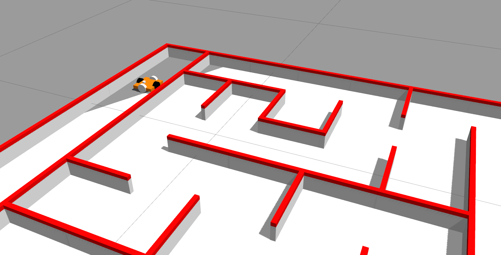

# International Micromouse Challenge

The objective was to design an autonomous bot simulated using ROS and Gazebo to reach from the corner square to the center of an unknown maze in the shortest time.

My team consisted of <a href="https://trunc8.github.io/">Siddharth Saha</a> and Shubham Agrawal. Led by Siddharth, our team won the competition completeling the track in minimum time with no penalities!

Our implementation can be seen <a href="https://www.youtube.com/watch?v=PcbNQ-tVwQw">here</a> and the link the repository is <a href="https://github.com/trunc8/international-micromouse-techfest2020">here.</a>

### <u>Design</u>
We came up with omni-wheeled bot to reduce steering latency.

### <u>Navigation</u>
The navigation problem was divided into two parts: 
1.Incrementally building a maze representation 
2.Path Planning & Control 

Part 1: Maze Representation
In the first part, there were several details adding to the complexity:

multiple reference frames attached to the world, the mobile robot, and our maze representation
odometry and laser scan data were in continuous position coordinates
conversion from the continuous position coordinates to discrete entries in our maze representation
After solving these, we dealt with the problem of noisy laser data. For this, we maintained a confidence matrix — if the same wall was seen above a threshold number of times, it would be added in the maze representation.

Part 2: Path Search and Planning
In order to deal with the lack of knowledge of the full maze in the exploration phase, we designed an online breadth-first search based planning algorithm that dynamically replanned whenever a new wall was seen and added to the modelled maze representation.

Approach to Minimize Time
The performance was timed in two phases: one exploratory phase and several final runs (best time considered). We began the exploration phase at a slower speed. Once it reached the target square, we incremented the speed by 0.03 m/s. This marked the end of exploration phase. Thereafter, each time it finished a final run, the speed was incremented. Evidently, it would reach high speeds within a few increments.

At some point, the speed would overpower the controls where it would slip and collide against the maze wall. Our algorithm routine gracefully shut down at that point. Since the best of final run times was taken, we were able to minimize it greatly while ascertaining that we definitely got the solution by starting at a slow velocity!

