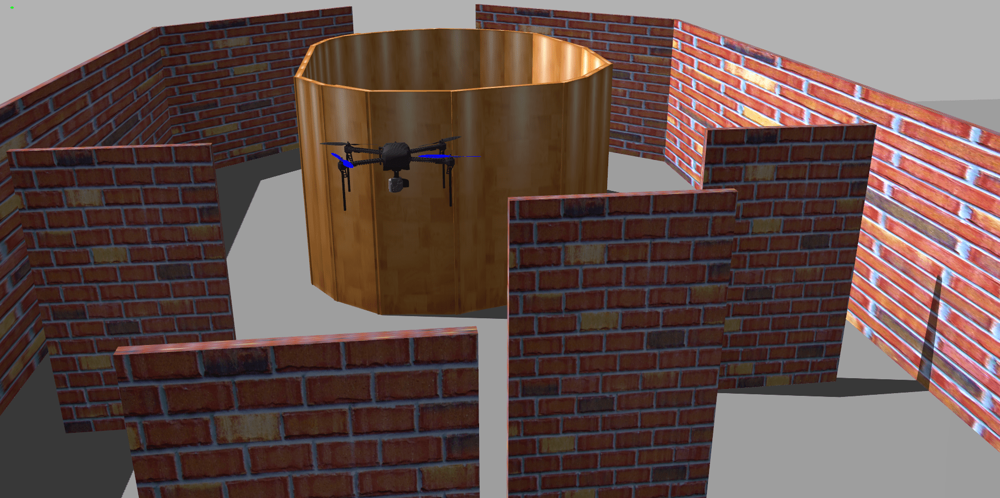

# Vision Based Obstacle Avoidance Drone

This compeititon was a part of <a href="https://www.facebook.com/interiit.tech/">**Inter IIT Technical Meet '21**</a> where we had to simulate quadrotor capable of navigating in a complex static environment by avoiding on-field obstacle-collision and reaching the target destination after its correct detection.

<!-- <iframe width="600" height="512"
src="https://www.youtube.com/watch?v=PdL64qHd97I&t=6930s">
</iframe> -->

For this purpose we came up with a three-layered navigation pipeline- Greedy Expploration, Scan and Survey and Sense of Progree vectors.
- For the first layer of decision making, we applied butterworth filters and performed manipulations on depth image to obtain the optimum waypoint for exploration.
- In case of dead ends, scan and survey pipeline tackles it by performing a scan operation to expand its field of view similar to a cone. These scan operations are performed at different altitudes.
- Though we could not implement it completely, the sense of progress vector pipeline intended at storing the history of poses to set a receding window to calculates the drone's overall progress direction.
The drone was simulated inside ROS/Gazebo using Ardupilot SITL.

The details of the implementation could be found in the following <a href="https://drive.google.com/file/d/1S8aawsni-Yod5IolbUaHhbD5gRYDpB4e/view?usp=sharing">presentation</a> and <a href="https://drive.google.com/file/d/1S8aawsni-Yod5IolbUaHhbD5gRYDpB4e/view?usp=sharing">github repository </a>.

Due to Covid, the technical meet was held in online mode and team consisting of 8 members worked on it from their own homes. A glimpse of the same could be found in the picture attached.

<!--  -->