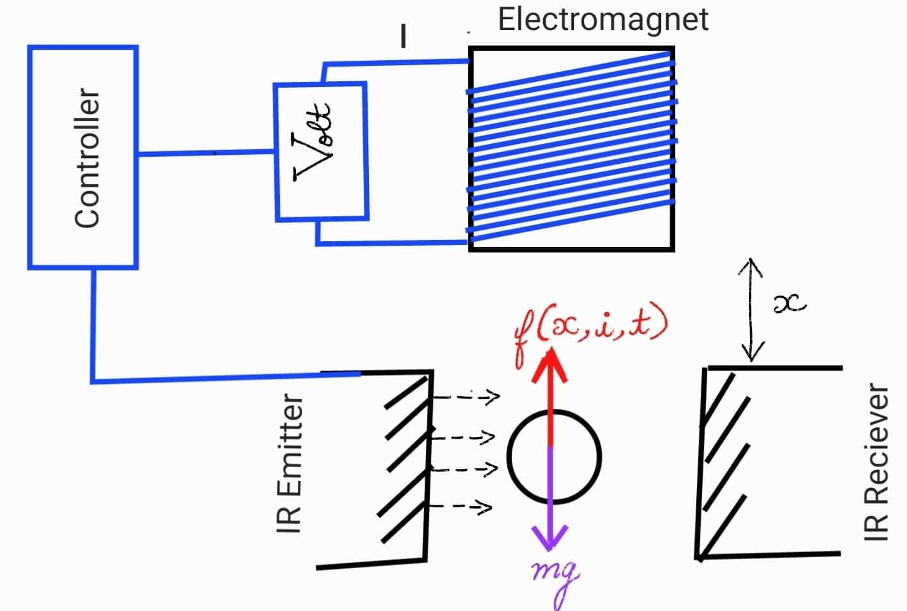
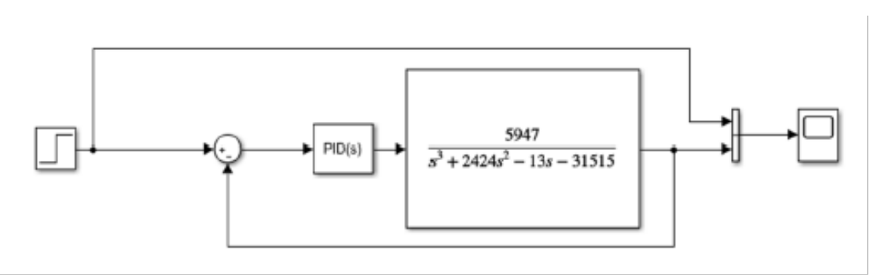
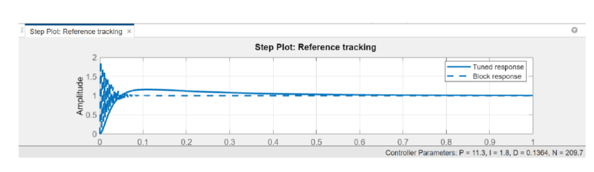
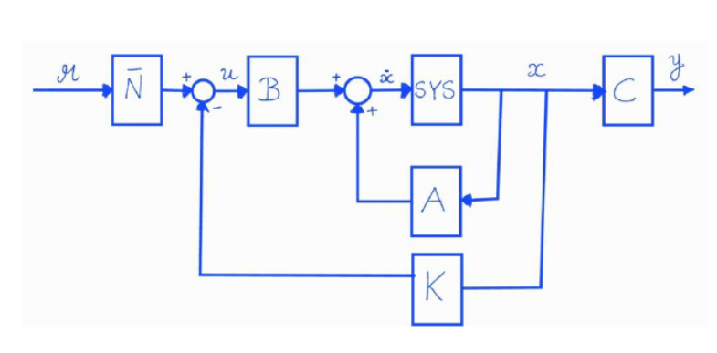
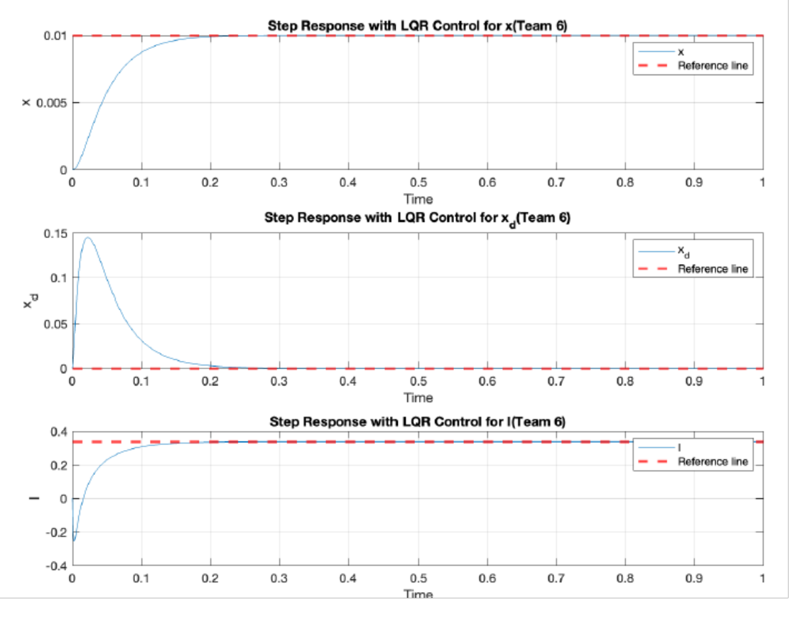

## Control Of Magnetic Levitation Using PID and LQR Controllers​
 

#### **Problem Statement**
Characterize a Single Input Single Output (SISO) system by identifying the input (applied current, I) and output (system's position, x). Utilize the dynamic equation of motion, incorporating gravitational (Fg) and magnetic forces (Fm), followed by linearization around an operational point (xe, Ie) to simplify equations for control theory applications.

#### **PID - Block Diagram & Results**

<i>Figure 1: Block Diagram for closed Loop System</i>

 

<i>Figure 2:  Amplitude response plot of Tuned and Blocked PID controllers</i>

 

#### **LQR - Block Diagram & Results**

<i>Figure 3: Block Diagram for State Feedback Controller with pre-compensator</i>

<i>Figure 4: Step response with LQR and pre-compensator (for each states)</i>

 

#### **Conclusion of Observations**
The project successfully achieves stable closed-loop system dynamics through the designed LQR state feedback controller and precompensator. The simulation results demonstrate impressive metrics such as swift rise time, settling time, and absence of overshoot. The incorporation of a precompensator significantly eliminates steady-state errors, highlighting its pivotal role in achieving precise control. Challenges related to inherent nonlinearities are acknowledged, and ongoing efforts towards refining the model for robustness and real-world applicability are emphasized. The project underscores the importance of linearization in controller design and sets the stage for further improvements and experimental validation.

#### **References**
- Presentation Slides can be found [here](https://docs.google.com/presentation/d/1mgIk_qbnqi0Q6mV9Qtt4uMvJehv3Yw2CoEjgVGXfmmk/edit?usp=sharing)
- Report of the project can be found [here](../pdfs/MAE506_Advanced_modeling.pdf)
