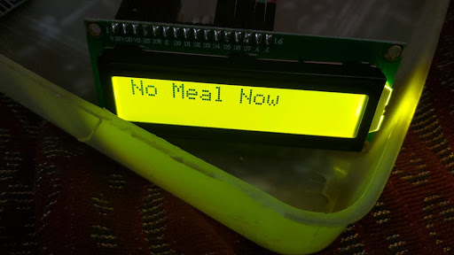
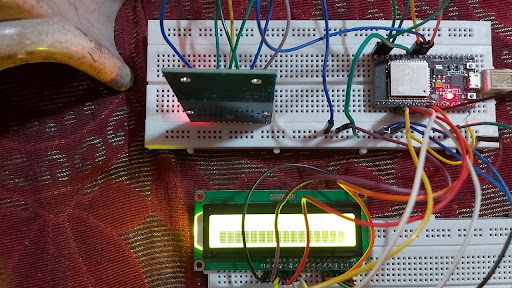
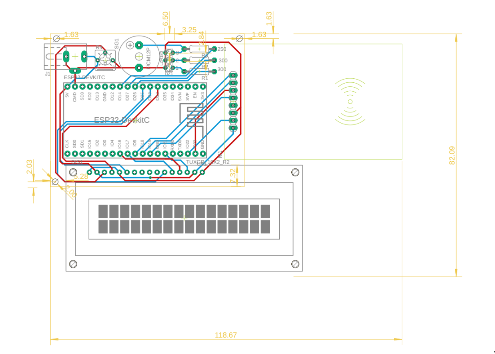

# Institute Mess Digitization Project

### Problem Statement
To digitize the mess to decrease mess workers’ burden to pick and place the mess cards and monthly bill calculation. Also, this would prevent someone from using other students’ mess cards.

### Approach
A database is stored in a central computer (RPI) made with Django, which Stores data like name, roll number, meal, card number, and the complete system is wireless based on MQTT protocol. 

As id cards are taken by students wherever they go, we thought of replacing them with mess cards. To do so, we use the RFID feature of our id cards which have unique numbers encoded into them.
The encoded number is detected using the RC522( RFID scanner). 
The ID card has to be placed over a box with an RFID scanner, an LCD indicating the meal approval, some LEDs to indicate pass or fail with the name and meal to be given printed on the LCD screen. This all is connected with a microcontroller( esp32) and all soldered into a single PCB and fitted in a 3D printed casing designed by us.
Because there are three counters in a mess( main meal, milk, extras), we will have a box containing the circuitry for each of the counters, and the main single-board computer( RPI) would be used as the master to all three boards.

