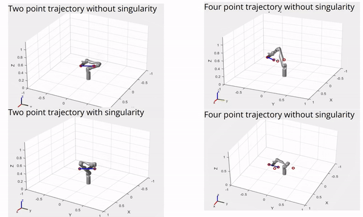
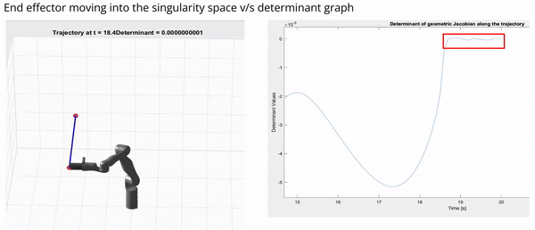

## Singularity Analysis of a Robotic Arm
 

#### **Problem Statement**
Singularity introduces a challenge for manipulation tasks. This project gives an insight into how the manipulator behaves and what causes the abnormal behaviour when the singularity is approached during a task. The objective of this project is to observe the behavior of the 6 DoF robotic arm in singularity space. 

#### **Results**

<i>Trajectory with singularity versus without singularity</i>

<i>End effector moving into the singularity space v/s determinant graph</i>

<i>Velocity Analysis</i>

#### **Observations**
The determinant of along the trajectory, once the robot entered it’s singularity, the value of determinant can drop from 10-4 to 10-6 in 0.005 seconds. (Average joint velocity increase from 2 x 10-3 m/s to 5 x 10-1 m/s). The singularity effects all the joints of the arm, although the amplitude of the effect may vary from joint to joint. In simulation, singularity can cause million times larger in maximum angular velocity which a  real world robot’s motor could hardly take.

#### **References**
- Presentation Slides can be found [here](https://docs.google.com/presentation/d/1pWjI-pksor5b-wgtyGRxmXzQLNMHgBYMaoCtgSRxlDg/edit?usp=sharing)
