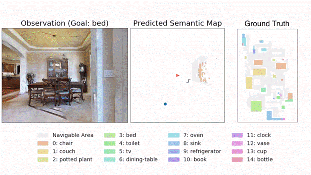

# Object Goal Navigation Enhancement using Goal-Oriented Semantic Exploration

## **Project Description:**
This project builds upon the foundation of the original research paper by introducing significant enhancements to the object goal navigation task. The original research paper presents a groundbreaking modular system, "Goal-Oriented Semantic Exploration," addressing object goal navigation challenges. It outperforms existing methods and won the CVPR-2020 Habitat ObjectNav Challenge, showcasing its effectiveness in both simulations and real-world mobile robot applications. Leveraging the **Yolov7** computer vision algorithm and the **RRT** (Rapidly-exploring Random Trees) path planning algorithm, we aim to revolutionize how robots navigate to a specified object category in unfamiliar environments.

## **Baseline:**
The baseline model in this object goal navigation task involves an agent that starts at a random location within an environment, with the goal of navigating to a specific object category, such as 'chair' or 'bed.' The agent receives visual observations in the form of first-person RGB and depth images, as well as sensor pose readings. It operates within an action space consisting of four actions: move_forward, turn_left, turn_right, and stop. The primary objective is to reach close proximity to the goal object and take the 'stop' action when it believes it has achieved this. If the agent's distance to the goal object falls below a threshold (ds = 1m), the episode is considered successful. Episodes are terminated after a fixed maximum number of time steps (timesteps = 500). The baseline serves as the starting point for evaluating the effectiveness of the proposed modular system, "Goal-Oriented Semantic Exploration," against other navigation methods, highlighting the challenges that traditional end-to-end learning-based approaches face in exploration and long-term planning within unfamiliar environments.

## **Key Components:**
1. **Semantic Mapping:** We leverage semantic segmentation and object detection models to predict object categories in first-person RGB and depth images. A spatial map is built, representing obstacles, explored areas, and object categories.

2. **Goal-Oriented Semantic Policy:** This policy module selects a long-term goal based on the semantic map. It considers the relative arrangement of objects and areas to determine where the goal object category is most likely to be found.

3. **Deterministic Local Policy:** The local policy employs the Fast Marching Method for path planning from the current location to the long-term goal. It takes deterministic actions to reach the goal efficiently.

## **Proposed Changes**

## **Results:**
Our project's empirical results in visually realistic simulation environments demonstrate that the proposed model outperforms a range of baselines, including end-to-end learning-based methods and modular map-based methods. It not only excels in exploration and long-term planning but also provides an effective solution for object goal navigation.

#### **Baseline of the Paper**

#### **Enhancements on Computer Vision**

**Note**: Baseline paper trains for 10M timesteps, our work runs for 1M due to time constraints

##### **Metrics**:

**SUCC**: Ratio of episodes where the method was successful.

**SPL**: Success weighted by Path Length (measures the efficiency of reaching the goal in addition to the success rate)

**DTG**: Distance to Success. (distance of the agent from the success threshold boundary when the episode ends)

## **Achievements:**
The modular system introduced in this project was the winning entry of the CVPR-2020 Habitat ObjectNav Challenge, showcasing its effectiveness and potential impact.

## **Future Scope:**
The modular design of our system allows for easy adaptation to real-world mobile robot platforms, promising further advancements in object goal navigation in real-world scenarios.

This project represents a significant contribution to the field of robotics and autonomous navigation, offering a versatile and efficient solution to the complex problem of finding and navigating to specific object categories in unfamiliar environments.

## References
1. [Semantic Exploration for Object Goal Navigation](https://arxiv.org/pdf/2007.00643.pdf)
2. [Project Website](https://devendrachaplot.github.io/projects/semantic-exploration)
3. Presented to CSE Department, ASU.
<iframe src="https://docs.google.com/presentation/d/e/2PACX-1vR9VradbqEfNySO1Fjpku2b4585q3omqgroM7CXoFyAkiPmHT6LWH7A8wXH3Lof2vSCia6NDczprC4-/embed?start=true&loop=true&delayms=3000" frameborder="0" width="960" height="569" allowfullscreen="true" mozallowfullscreen="true" webkitallowfullscreen="true"></iframe>
