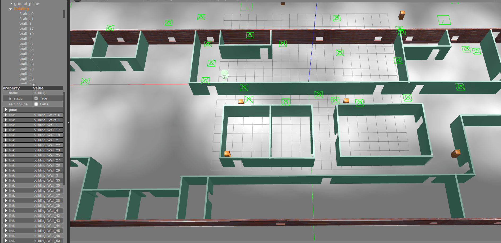
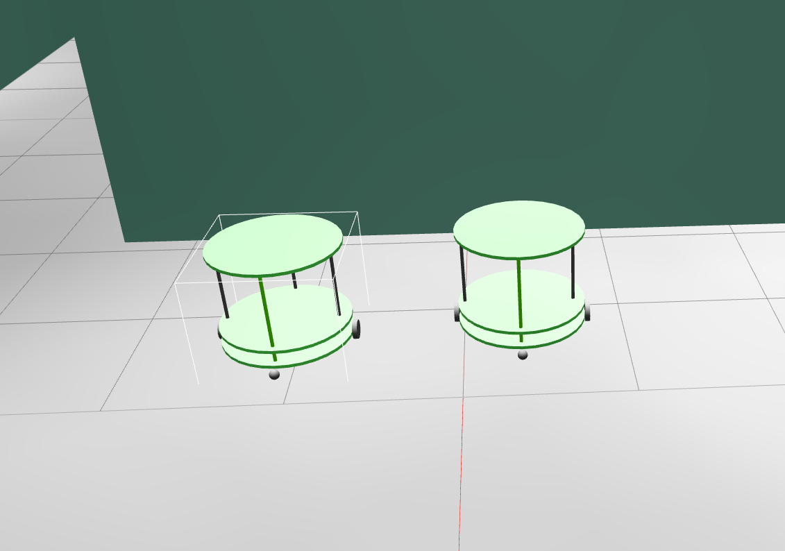
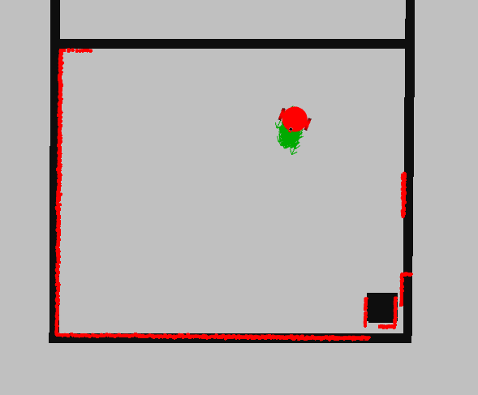
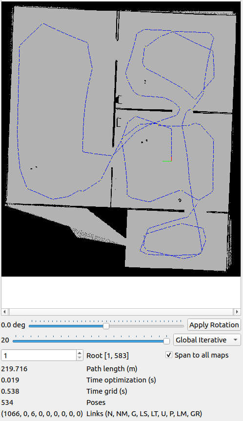
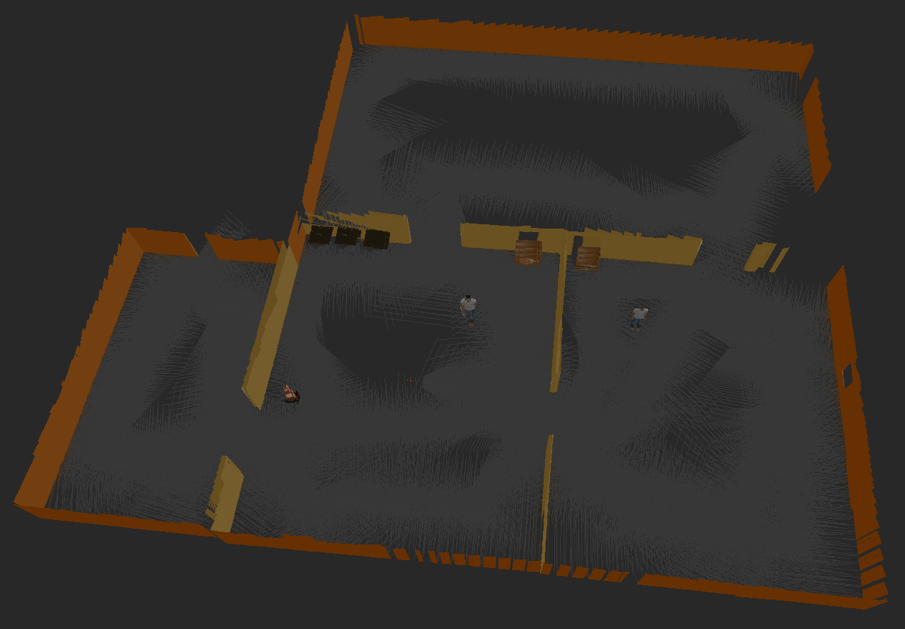
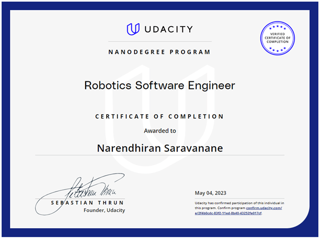

### Home-Service Robot Project
The Home-Service Robot Project showcases a mobile robot's autonomous navigation and manipulation in a simulated environment using ROS and Gazebo. Leveraging Gazebo's Building and Model Editors, the project features a dynamic environment with advanced sensors integrated seamlessly. The robot autonomously chases a white ball, demonstrating robust ROS-based control. Accurate localization with AMCL and efficient mapping and navigation using gmapping and move_base highlight the project's success in simulating cutting-edge robotics concepts.

**Building Editor**: 

**Variety of Models**: 

#### **Autonomous Operation**
**Ball Chasing:** A key highlight of the project is the robot's ability to autonomously **chase a white-colored ball** within the environment. This impressive capability is achieved through the implementation of ROS nodes for interaction and navigation.

  <iframe width="660" height="415" src="https://www.youtube.com/embed/bR12gWMfKFI?si=rR5MFLuPMTm61K83" title="YouTube video player" frameborder="0" allow="accelerometer;   clipboard-write; encrypted-media; gyroscope; picture-in-picture; web-share" allowfullscreen></iframe>

 

#### **Precise Localization**
**AMCL Package:** Accurate **localization** is fundamental to the robot's autonomy. The project utilizes the **Adaptive Monte Carlo Localization (AMCL)** package, a particle filter-based algorithm. 
 

#### **Mapping and Navigation**
**Gmapping and Move_Base**
Efficient **mapping** and **navigation** are achieved using the **gmapping** package for 2D occupancy grid mapping. This technology allows the robot to build and utilize maps for its autonomous movement. The **move_base** package serves as the high-level navigation controller, employing a combination of global and local path planning algorithms to enable obstacle avoidance and efficient goal attainment.
**Mapping Images:**

  | 

#### **Path Planning** 

  <iframe width="560" height="315" src="https://www.youtube.com/embed/ik1velzFdnU?si=VNzeOj0Sr-WkwXTc" title="YouTube video player" frameborder="0" allow="accelerometer;   clipboard-write; encrypted-media; gyroscope; picture-in-picture; web-share" allowfullscreen></iframe>

#### **Conclusion**
The Home-Service Robot Project is a testament to the convergence of cutting-edge robotics concepts and technologies. It highlights the robot's prowess in autonomous navigation, localization, and interaction within a simulated environment. This project showcases the immense potential of ROS and Gazebo for simulating and validating robotic systems.

<!-- For in-depth technical details and access to project code, please visit the [GitHub repository](https://github.com/example/home-service-robot). -->

#### **Certificates and Achievements**
Secured an excellent completion reward from the Udacity Team. [Graduation Credential](https://confirm.udacity.com/e/2f4b0cdc-83f2-11ed-8b40-43252fe017cf)

