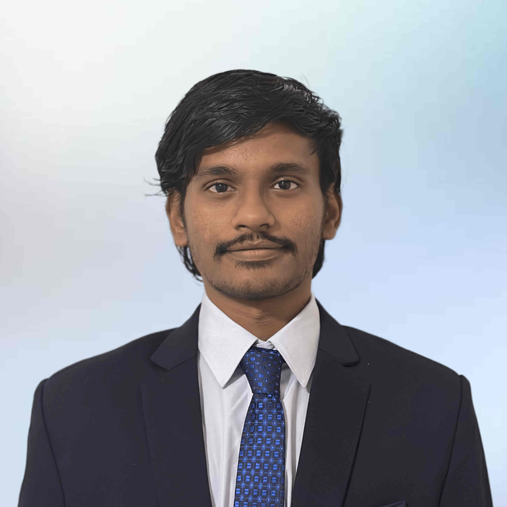
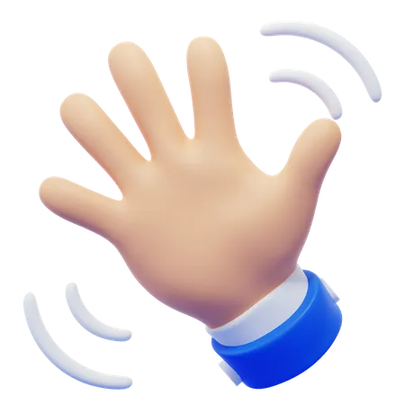

 <strong>Table of Content&ensp;</strong> | <a href="#whatido">&ensp;What I Work On&ensp; </a> | <a href="#throughline">&ensp;The Through-Line&ensp;</a> | <a href="#achievements">&ensp;Achievements&ensp;</a> | <a href="#Questionsexcitesme">&ensp;Questions That Excite Me</a> 

<!-- # **About Me** -->
<h1 style="text-align: center;"><b>ABOUT ME</b></h1>
 

  

    
  

 

  

    
Hello there  I am <b>Narendhiran</b>. My friends call me Naren (Neh-R-ehN).
      

  

     
  

    <h1 id="whatido"><b>What I Work On</b></h1>
    

    I work on <b>physical AI</b> — making robots physically capable in the real world. Everyone is racing to give robots a better <i>mind</i>. I work on the harder, less crowded half: a <i>body</i> that can actually touch and handle the world. Models that look brilliant in a notebook still fall apart the moment they meet real hardware and real mess. Closing that gap is the part of robotics I care about most.
    

     
    

    Today I'm the <b>first robotics &amp; ML engineer at <a href="/experience/">Sensetics</a></b>, a UC&nbsp;Berkeley spin-out building tactile sensing for humanoid robots. I built out the robotics function there — taking frontier, still-unproven sensing research and turning it into a working <b>sense of touch</b> on a real robot: integration, signal processing, and the unglamorous engineering that makes lab tech survive the physical world.
    

     
    

    There are two archetypes in this space. <b>Inventors</b> — the PhDs and physicists who invent the sensor and publish the paper. And <b>integrators</b> — the engineers who take that fragile, exotic lab tech and make a real robot actually <i>use</i> it. I'm firmly the second, and that's the seat I want.
    

  

   
  

   
  

    <h2 id="throughline"><b>The Through-Line</b></h2>
     
    

    The thread across everything I've built is the same: <b>making robots perceive and act in the messy, unstructured real world.</b> Touch is just the newest instance of it, not a departure.
    

    

    I graduated from <a href="https://www.iitp.ac.in/">IIT Patna</a> in 2022 with a B.Tech in <a href="https://www.iitp.ac.in/index.php/departments/engineering-technology/mechanical-engineering/">Mechanical Engineering</a>, where my capstone — a motion-prediction model for a towed floating object, under <a href="https://www.iitp.ac.in/index.php/people-6/faculty/2-uncategorised/241-view-profile-38">Prof. Subrata Kumar</a> — was recognized as an Undergraduate Project Finalist. I then earned my <a href="https://ras.engineering.asu.edu/">M.S. in Robotics &amp; Autonomous Systems</a> from <a href="https://robotics.asu.edu/">ASU</a> in 2024 (distinction, A's across all ten courses), focused on perception, machine learning, and autonomous driving in the CARLA simulator, and co-authored a paper at <b>IEEE ACC 2024</b> in <a href="https://www.linkedin.com/in/xu-zhe/">Prof. Zhe Xu's</a> lab.
    

    

    From there the work kept moving toward real robots in the real world: robotic software for precision agriculture at <b>Padma Agrobotics</b> (ROS2 systems, sensor and GPS-encoder fusion, on-field perception models), an LLM-driven humanoid behavior stack at <b>DreamFace Technologies</b>, and now tactile sensing for humanoids at <b>Sensetics</b>. Autonomous driving → aerial → agriculture → touch: different domains, one problem — perception and action at the point where a robot meets the physical world.
    

    <h6 id="achievements"><b>Achievements &amp; Research</b></h6>
     
    

    Under my leadership, IIT Patna's team became <a href="https://drive.google.com/file/d/1kweAUygwfA52OVF7uBK29grWofsJmhxy/view?usp=sharing">National Finalists</a> in the 2019–20 <a href="https://portal.e-yantra.org/#about">e-Yantra Robotics Competition</a> (eYRC) at <a href="https://www.iitb.ac.in/">IIT Bombay</a> — 4th of 1,051 teams — building an autonomous transport robot for disaster response. I later devised a simulator ecosystem for autonomous evaluation of the competition, earning recognition in the <a href="https://www.e-yantra.org/eysip">e-YSIP program</a> under <a href="https://www.linkedin.com/in/kavi-arya/?originalSubdomain=in">Prof. Kavi Arya</a> at IIT Bombay. My most recent public build is a <a href="/projects/cupstacking">cup-stacking robot</a> from the NVIDIA × Seeed Embodied AI Hackathon — a public foundation model (GR00T 1.5 + ACT) taken all the way to a real arm on a Jetson Thor.
    
 
  

   
  

   
  

    <h2 id="Questionsexcitesme"><b>Questions that Excite Me</b></h2> 
    

      <b>1) Why is the body the bottleneck, not the brain?</b>   &emsp;&ensp;Foundation models are racing ahead, yet robots still can't reliably grasp a cup without knocking it over. What does it take to give a machine a body that can touch, feel, and handle the world as fluently as it can reason about it? <a href="/projects/cupstacking">Related work</a>  
      <b>2) Robotic autonomy in unstructured environments:</b>   &emsp;&ensp;How do we get robots to navigate and act reliably in unpredictable, real-world settings — disaster zones, farms, homes — instead of tightly controlled labs? <a href="/projects/eyrc">Related work</a>  
      <b>3) Experiential learning in robotics:</b>  &emsp;&ensp;How can robots gain real-world experience to improve their performance and adaptability over time? <a href="/projects/objectgoalnav">Related work</a>  
      <b>4) AI-driven precision agriculture:</b>  &emsp;&ensp;How can AI-powered robots optimize crop yields while minimizing resource use and environmental impact? <a href="/projects/mambo">Related work</a>  
    
 
    

      Away from robots, I'm the person who wants to know how everyday things actually work — and someone who genuinely lights up at other people's craft. Nothing quite electrifies me like AC/DC tearing through "<a href="https://youtu.be/xRQnJyP77tY">Shoot to Thrill</a>" on the drums, or Miles Teller's take on "<a href="https://youtu.be/pVcMsjyKlaM">Great Balls of Fire</a>."
    
 

   

This country counter shows visits to this landing page since Sep 19, 2023. <a href="https://www.revolvermaps.com/">Credits</a>



   

