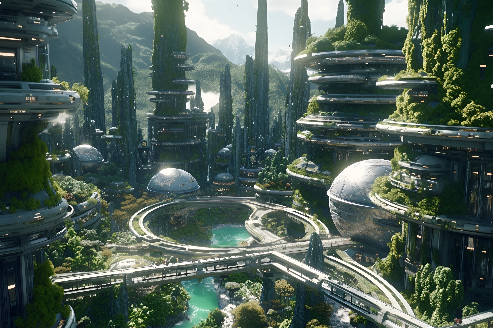
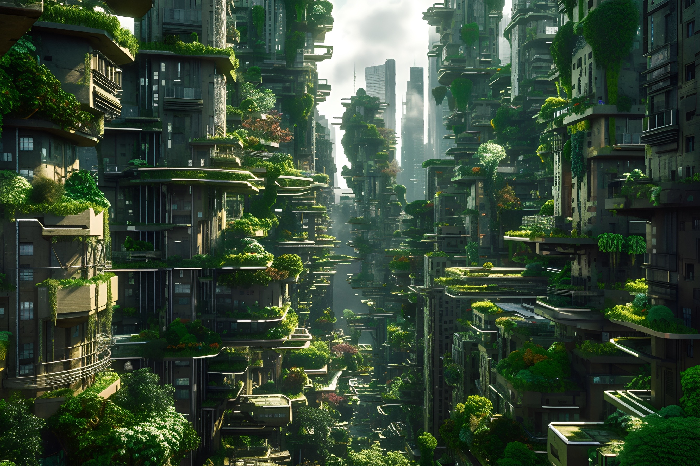



 

 
 

<h4 class="page-heading">Skills</h4>
 




 

 
 

<h4 class="page-heading" id="Future-Imagination">There's a long road ahead, but we're on the right track.</h4> 

  

    

      
    

    

      
    

    

      
    

    

      
    

    

      
    

    

      
    

    <!-- 
<h4>1</h4>

    
<h4>2</h4>

    
<h4>3</h4>

    
<h4>4</h4>

    
<h4>5</h4>

    
<h4>6</h4>

    
<h4>7</h4>

    
<h4>8</h4>

    
<h4>9</h4>

    
<h4>10</h4>

    
<h4>11</h4>

    
<h4>12</h4>
 -->
  

  

  

  

